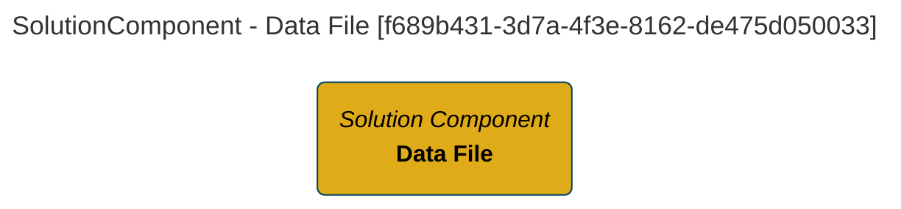

```mermaid
---
title: SolutionComponent - Data File [f689b431-3d7a-4f3e-8162-de475d050033]
---
flowchart TD
%%{init: {"flowchart": {"htmlLabels": false}} }%%

1@{ shape: rounded, label: "*Solution Component*
**Data File**"}
style 1 color:#000000, fill:#e0ab18, stroke:#004563
click 1 "https://egeria-project.org/types/2/0220-Files-and-Folders/" "Click for more documentation" _blank
```
> Data File: A file containing data.  This may be structured data, text or some form or media file. (Extracted from 6.0-SNAPSHOT)
