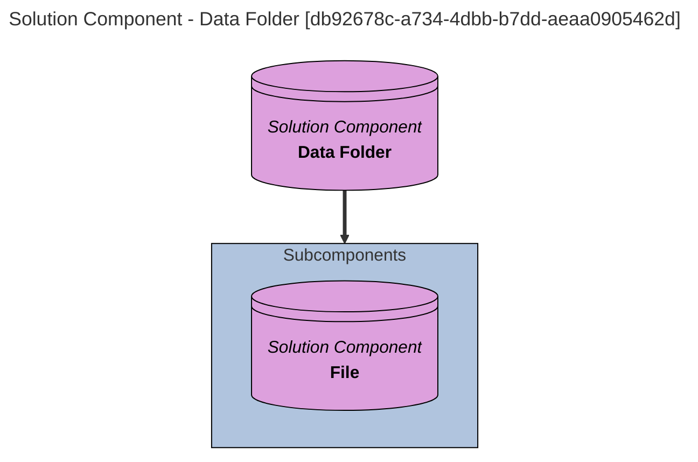

```mermaid
---
title: Solution Component - Data Folder [db92678c-a734-4dbb-b7dd-aeaa0905462d]
---
flowchart TD
%%{init: {"flowchart": {"htmlLabels": false}} }%%

1@{ shape: lin-cyl, label: "*Solution Component*
**Data Folder**"}
subgraph 2 [Subcomponents]
3@{ shape: lin-cyl, label: "*Solution Component*
**File**"}
end
1==>2
style 1 color:#000000, fill:#dda0dd, stroke:#000000
style 2 color:#000000, fill:#b0c4de, stroke:#000000
style 3 color:#000000, fill:#dda0dd, stroke:#000000
click 1 "https://egeria-project.org/types/2/0220-Files-and-Folders/" "Click for more documentation" _blank
click 3 "https://egeria-project.org/types/2/0220-Files-and-Folders/" "Click for more documentation" _blank
```
> Data Folder: A directory (folder) that holds files representing a single data source. (Extracted from 6.0-SNAPSHOT)
