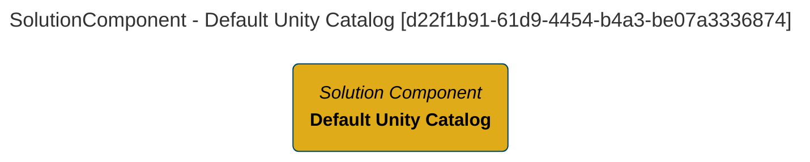

```mermaid
---
title: SolutionComponent - Default Unity Catalog [d22f1b91-61d9-4454-b4a3-be07a3336874]
---
flowchart TD
%%{init: {"flowchart": {"htmlLabels": false}} }%%

1@{ shape: rounded, label: "*Solution Component*
**Default Unity Catalog**"}
style 1 color:#000000, fill:#e0ab18, stroke:#004563
click 1 "https://www.unitycatalog.io/" "Click for more documentation" _blank
```
> Default Unity Catalog: Open Source version of Unity Catalog with the default catalog. (Extracted from 6.0-SNAPSHOT)
