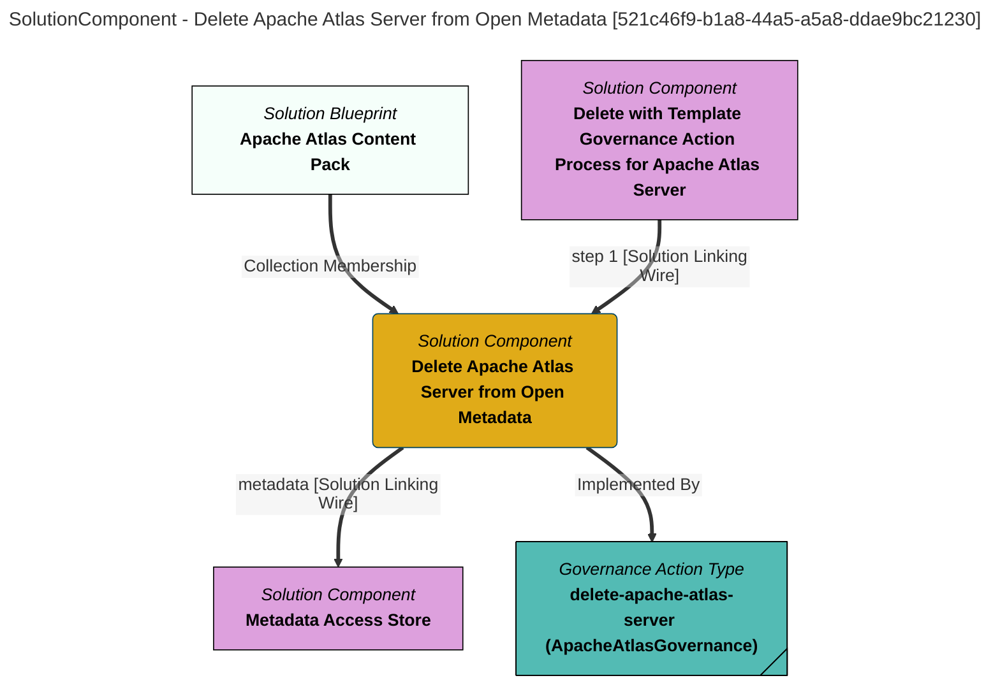

```mermaid
---
title: SolutionComponent - Delete Apache Atlas Server from Open Metadata [521c46f9-b1a8-44a5-a5a8-ddae9bc21230]
---
flowchart TD
%%{init: {"flowchart": {"htmlLabels": false}} }%%

1@{ shape: rounded, label: "*Solution Component*
**Delete Apache Atlas Server from Open Metadata**"}
2@{ shape: rect, label: "*Solution Blueprint*
**Apache Atlas Content Pack**"}
2==>|"Collection Membership"|1
3@{ shape: rect, label: "*Solution Component*
**Delete with Template Governance Action Process for Apache Atlas Server**"}
3==>|"step 1 [Solution Linking Wire]"|1
4@{ shape: rect, label: "*Solution Component*
**Metadata Access Store**"}
1==>|"metadata [Solution Linking Wire]"|4
5@{ shape: tag-rect, label: "*Governance Action Type*
**delete-apache-atlas-server (ApacheAtlasGovernance)**"}
1==>|"Implemented By"|5
style 1 color:#000000, fill:#e0ab18, stroke:#004563
style 2 color:#000000, fill:#f5fffa, stroke:#000000
style 3 color:#000000, fill:#dda0dd, stroke:#000000
style 4 color:#000000, fill:#dda0dd, stroke:#000000
style 5 color:#000000, fill:#53bbb4, stroke:#000000
click 1 "https://egeria-project.org/concepts/governance-action-type/" "Click for more documentation" _blank
click 3 "https://egeria-project.org/egeria-solutions/leveraging-apache-atlas/overview/" "Click for more documentation" _blank
click 4 "https://egeria-project.org/concepts/metadata-access-store/" "Click for more documentation" _blank
```
> Delete Apache Atlas Server from Open Metadata: Delete asset from the metadata repository. (Extracted from 6.0-SNAPSHOT)
