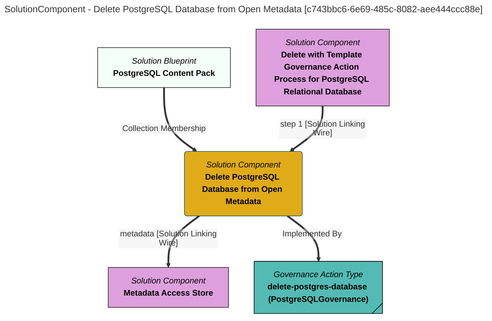

> Delete PostgreSQL Database from Open Metadata: Locate and delete the open metadata element that represents the PostgreSQL database described in the request.  The real database on the PostgreSQL server (if any) is unaffected by this component. (Extracted from 6.0-SNAPSHOT)
