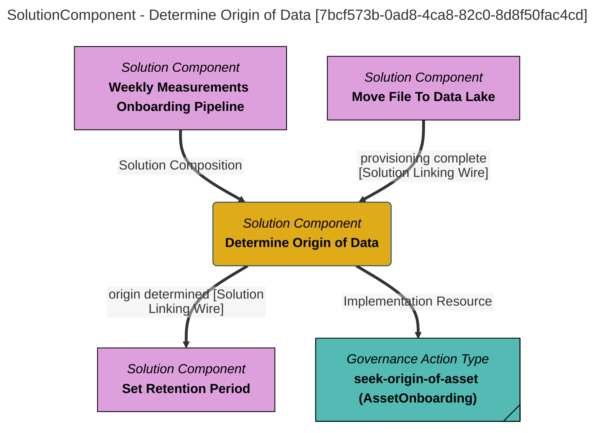

```mermaid
---
title: SolutionComponent - Determine Origin of Data [7bcf573b-0ad8-4ca8-82c0-8d8f50fac4cd]
---
flowchart TD
%%{init: {"flowchart": {"htmlLabels": false}} }%%

1@{ shape: rounded, label: "*Solution Component*
**Determine Origin of Data**"}
2@{ shape: rect, label: "*Solution Component*
**Weekly Measurements Onboarding Pipeline**"}
2==>|"Solution Composition"|1
3@{ shape: rect, label: "*Solution Component*
**Set Retention Period**"}
1==>|"origin determined [Solution Linking Wire]"|3
4@{ shape: rect, label: "*Solution Component*
**Move File To Data Lake**"}
4==>|"provisioning complete [Solution Linking Wire]"|1
5@{ shape: tag-rect, label: "*Governance Action Type*
**seek-origin-of-asset (AssetOnboarding)**"}
1==>|"Implementation Resource"|5
style 1 color:#000000, fill:#e0ab18, stroke:#004563
style 2 color:#000000, fill:#dda0dd, stroke:#000000
style 3 color:#000000, fill:#dda0dd, stroke:#000000
style 4 color:#000000, fill:#dda0dd, stroke:#000000
style 5 color:#000000, fill:#53bbb4, stroke:#000000
```
> Determine Origin of Data: Add details of the originating hospital. (Extracted from V1.0)
