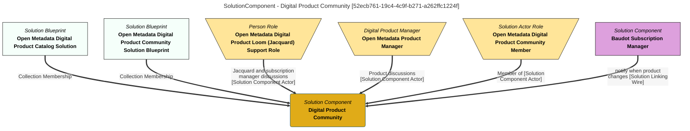

```mermaid
---
title: SolutionComponent - Digital Product Community [52ecb761-19c4-4c9f-b271-a262ffc1224f]
---
flowchart TD
%%{init: {"flowchart": {"htmlLabels": false}} }%%

1@{ shape: rounded, label: "*Solution Component*
**Digital Product Community**"}
2@{ shape: rect, label: "*Solution Blueprint*
**Open Metadata Digital Product Catalog Solution**"}
2==>|"Collection Membership"|1
3@{ shape: rect, label: "*Solution Blueprint*
**Open Metadata Digital Product Community Solution Blueprint**"}
3==>|"Collection Membership"|1
4@{ shape: trap-t, label: "*Person Role*
**Open Metadata Digital Product Loom (Jacquard) Support Role**"}
4==>|"Jacquard and subscription manager discussions [Solution Component Actor]"|1
5@{ shape: trap-t, label: "*Digital Product Manager*
**Open Metadata Product Manager**"}
5==>|"Product discussions [Solution Component Actor]"|1
6@{ shape: trap-t, label: "*Solution Actor Role*
**Open Metadata Digital Product Community Member**"}
6==>|"Member of [Solution Component Actor]"|1
7@{ shape: rect, label: "*Solution Component*
**Baudot Subscription Manager**"}
7==>|"notify when product changes [Solution Linking Wire]"|1
style 1 color:#000000, fill:#e0ab18, stroke:#004563
style 2 color:#000000, fill:#f5fffa, stroke:#000000
style 3 color:#000000, fill:#f5fffa, stroke:#000000
style 4 color:#000000, fill:#FFE599, stroke:#000000
style 5 color:#000000, fill:#FFE599, stroke:#000000
style 6 color:#000000, fill:#FFE599, stroke:#000000
style 7 color:#000000, fill:#dda0dd, stroke:#000000
```
> Digital Product Community: The community of interest for those people who are using the open metadata digital products. (Extracted from 6.0-SNAPSHOT)
