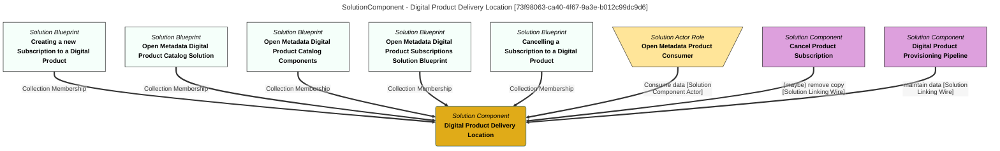

```mermaid
---
title: SolutionComponent - Digital Product Delivery Location [73f98063-ca40-4f67-9a3e-b012c99dc9d6]
---
flowchart TD
%%{init: {"flowchart": {"htmlLabels": false}} }%%

1@{ shape: rounded, label: "*Solution Component*
**Digital Product Delivery Location**"}
2@{ shape: rect, label: "*Solution Blueprint*
**Creating a new Subscription to a Digital Product**"}
2==>|"Collection Membership"|1
3@{ shape: rect, label: "*Solution Blueprint*
**Open Metadata Digital Product Catalog Solution**"}
3==>|"Collection Membership"|1
4@{ shape: rect, label: "*Solution Blueprint*
**Open Metadata Digital Product Catalog Components**"}
4==>|"Collection Membership"|1
5@{ shape: rect, label: "*Solution Blueprint*
**Open Metadata Digital Product Subscriptions Solution Blueprint**"}
5==>|"Collection Membership"|1
6@{ shape: rect, label: "*Solution Blueprint*
**Cancelling a Subscription to a Digital Product**"}
6==>|"Collection Membership"|1
7@{ shape: trap-t, label: "*Solution Actor Role*
**Open Metadata Product Consumer**"}
7==>|"Consume data [Solution Component Actor]"|1
8@{ shape: rect, label: "*Solution Component*
**Cancel Product Subscription**"}
8==>|"(maybe) remove copy [Solution Linking Wire]"|1
9@{ shape: rect, label: "*Solution Component*
**Digital Product Provisioning Pipeline**"}
9==>|"maintain data [Solution Linking Wire]"|1
style 1 color:#000000, fill:#e0ab18, stroke:#004563
style 2 color:#000000, fill:#f5fffa, stroke:#000000
style 3 color:#000000, fill:#f5fffa, stroke:#000000
style 4 color:#000000, fill:#f5fffa, stroke:#000000
style 5 color:#000000, fill:#f5fffa, stroke:#000000
style 6 color:#000000, fill:#f5fffa, stroke:#000000
style 7 color:#000000, fill:#FFE599, stroke:#000000
style 8 color:#000000, fill:#dda0dd, stroke:#000000
style 9 color:#000000, fill:#dda0dd, stroke:#000000
```
> Digital Product Delivery Location: This is the service that copies the product data to each of the subscribers'' delivery location. (Extracted from 6.0-SNAPSHOT)
