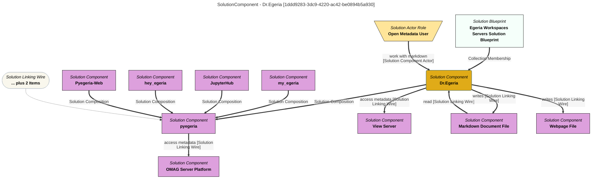

```mermaid
---
title: SolutionComponent - Dr.Egeria [1ddd9283-3dc9-4220-ac42-be0894b5a930]
---
flowchart TD
%%{init: {"flowchart": {"htmlLabels": false}} }%%

1@{ shape: rounded, label: "*Solution Component*
**Dr.Egeria**"}
2@{ shape: rect, label: "*Solution Blueprint*
**Egeria Workspaces Servers Solution Blueprint**"}
2==>|"Collection Membership"|1
3@{ shape: rect, label: "*Solution Component*
**pyegeria**"}
1==>|"Solution Composition"|3
4@{ shape: rect, label: "*Solution Component*
**my_egeria**"}
4==>|"Solution Composition"|3
5@{ shape: rect, label: "*Solution Component*
**JupyterHub**"}
5==>|"Solution Composition"|3
6@{ shape: rect, label: "*Solution Component*
**hey_egeria**"}
6==>|"Solution Composition"|3
7@{ shape: rect, label: "*Solution Component*
**Pyegeria-Web**"}
7==>|"Solution Composition"|3
8@{ shape: rect, label: "*Solution Component*
**OMAG Server Platform**"}
3==>|"access metadata [Solution Linking Wire]"|8
9@{ shape: stadium, label: "*Solution Linking Wire*
**... plus 2 Items**"}
9-.->3
10@{ shape: trap-t, label: "*Solution Actor Role*
**Open Metadata User**"}
10==>|"work with markdown [Solution Component Actor]"|1
11@{ shape: rect, label: "*Solution Component*
**View Server**"}
1==>|"access metadata [Solution Linking Wire]"|11
12@{ shape: rect, label: "*Solution Component*
**Markdown Document File**"}
12==>|"read [Solution Linking Wire]"|1
13@{ shape: rect, label: "*Solution Component*
**Webpage File**"}
1==>|"writes [Solution Linking Wire]"|13
1==>|"writes [Solution Linking Wire]"|12
style 11 color:#000000, fill:#dda0dd, stroke:#000000
style 12 color:#000000, fill:#dda0dd, stroke:#000000
style 13 color:#000000, fill:#dda0dd, stroke:#000000
style 1 color:#000000, fill:#e0ab18, stroke:#004563
style 2 color:#000000, fill:#f5fffa, stroke:#000000
style 3 color:#000000, fill:#dda0dd, stroke:#000000
style 4 color:#000000, fill:#dda0dd, stroke:#000000
style 5 color:#000000, fill:#dda0dd, stroke:#000000
style 6 color:#000000, fill:#dda0dd, stroke:#000000
style 7 color:#000000, fill:#dda0dd, stroke:#000000
style 8 color:#000000, fill:#dda0dd, stroke:#000000
style 9 color:#000000, fill:#F9F7ED, stroke:#b7c0c7
style 10 color:#000000, fill:#FFE599, stroke:#000000
click 11 "https://egeria-project.org/concepts/metadata-access-server/" "Click for more documentation" _blank
click 12 "https://en.wikipedia.org/wiki/Markdown" "Click for more documentation" _blank
click 13 "https://en.wikipedia.org/wiki/HTML" "Click for more documentation" _blank
click 3 "https://egeria-project.org/concepts/pyegeria/" "Click for more documentation" _blank
click 5 "https://jupyter.org/hub" "Click for more documentation" _blank
click 6 "https://egeria-project.org/user-interfaces/hey-egeria/overview/" "Click for more documentation" _blank
click 8 "https://egeria-project.org/concepts/omag-server-platform/" "Click for more documentation" _blank
```
> Dr.Egeria: A markdown processor that can maintain and retrieve open metadata by processing and creating markdown documents. (Extracted from 6.0-SNAPSHOT)
