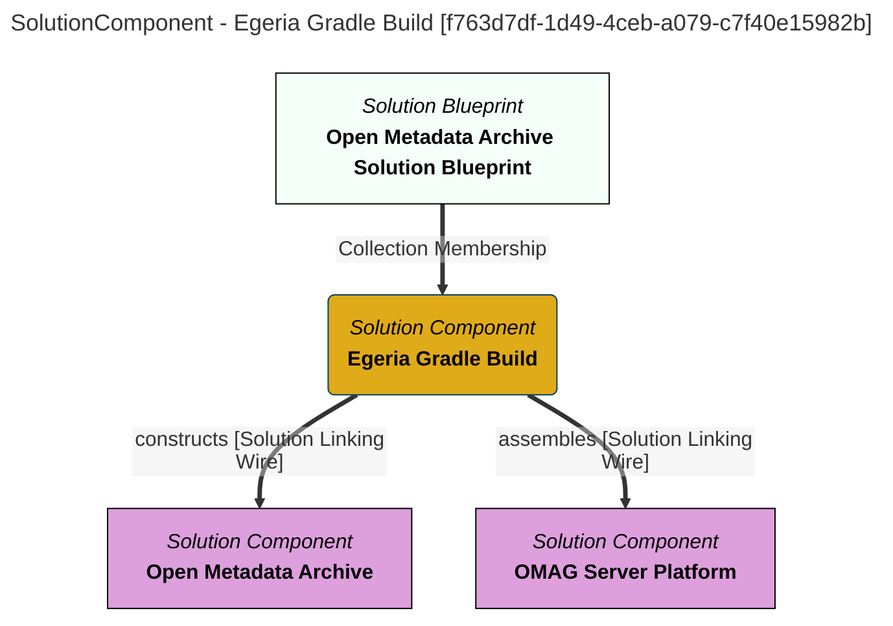

```mermaid
---
title: SolutionComponent - Egeria Gradle Build [f763d7df-1d49-4ceb-a079-c7f40e15982b]
---
flowchart TD
%%{init: {"flowchart": {"htmlLabels": false}} }%%

1@{ shape: rounded, label: "*Solution Component*
**Egeria Gradle Build**"}
2@{ shape: rect, label: "*Solution Blueprint*
**Open Metadata Archive Solution Blueprint**"}
2==>|"Collection Membership"|1
3@{ shape: rect, label: "*Solution Component*
**Open Metadata Archive**"}
1==>|"constructs [Solution Linking Wire]"|3
4@{ shape: rect, label: "*Solution Component*
**OMAG Server Platform**"}
1==>|"assembles [Solution Linking Wire]"|4
style 1 color:#000000, fill:#e0ab18, stroke:#004563
style 2 color:#000000, fill:#f5fffa, stroke:#000000
style 3 color:#000000, fill:#dda0dd, stroke:#000000
style 4 color:#000000, fill:#dda0dd, stroke:#000000
click 3 "https://egeria-project.org/concepts/open-metadata-archive/" "Click for more documentation" _blank
click 4 "https://egeria-project.org/concepts/omag-server-platform/" "Click for more documentation" _blank
```
> Egeria Gradle Build: Comprehensive build process that complies the software, runs tests and creates the assembly for Egeria''s runtime. (Extracted from 6.0-SNAPSHOT)
