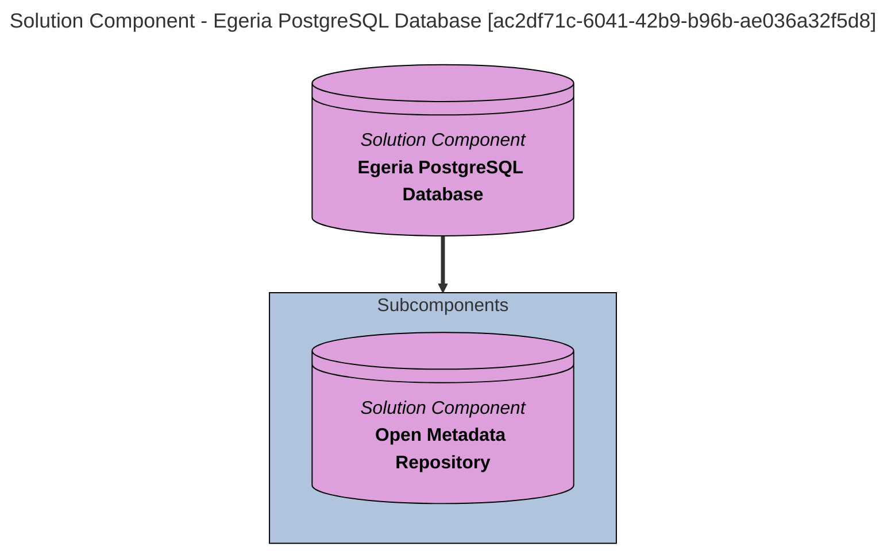

```mermaid
---
title: Solution Component - Egeria PostgreSQL Database [ac2df71c-6041-42b9-b96b-ae036a32f5d8]
---
flowchart TD
%%{init: {"flowchart": {"htmlLabels": false}} }%%

1@{ shape: lin-cyl, label: "*Solution Component*
**Egeria PostgreSQL Database**"}
subgraph 2 [Subcomponents]
3@{ shape: lin-cyl, label: "*Solution Component*
**Open Metadata Repository**"}
end
1==>2
style 1 color:#000000, fill:#dda0dd, stroke:#000000
style 2 color:#000000, fill:#b0c4de, stroke:#000000
style 3 color:#000000, fill:#dda0dd, stroke:#000000
click 3 "https://egeria-project.org/concepts/open-metadata-repository/" "Click for more documentation" _blank
```
> Egeria PostgreSQL Database: This database supports the different repositories used by the Egeria runtime. (Extracted from 6.0-SNAPSHOT)
