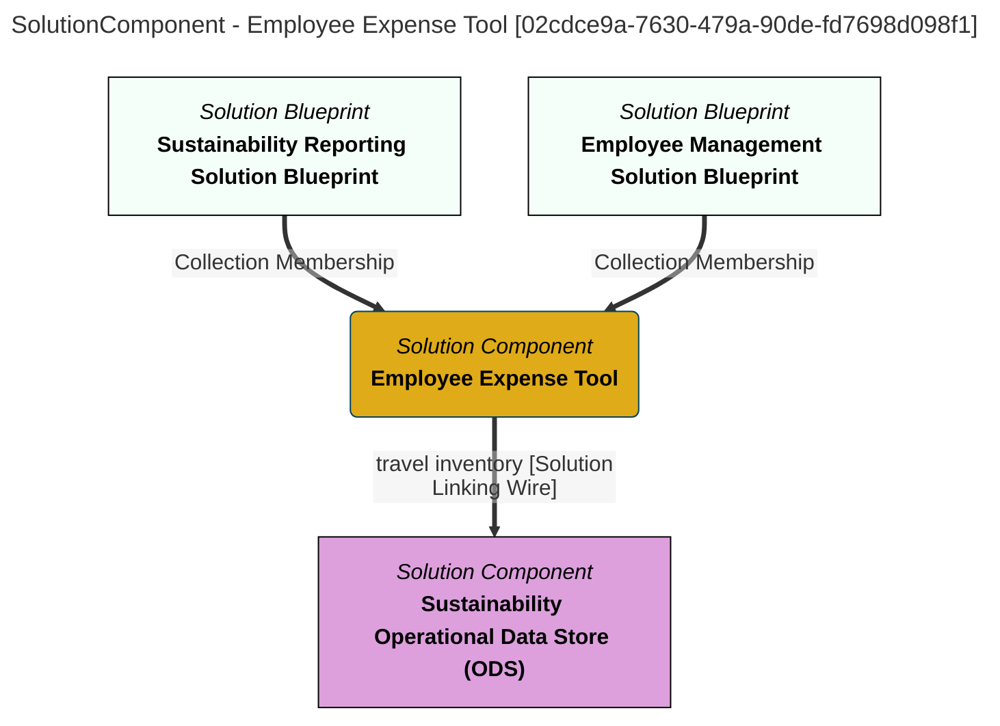

```mermaid
---
title: SolutionComponent - Employee Expense Tool [02cdce9a-7630-479a-90de-fd7698d098f1]
---
flowchart TD
%%{init: {"flowchart": {"htmlLabels": false}} }%%

1@{ shape: rounded, label: "*Solution Component*
**Employee Expense Tool**"}
2@{ shape: rect, label: "*Solution Blueprint*
**Sustainability Reporting Solution Blueprint**"}
2==>|"Collection Membership"|1
3@{ shape: rect, label: "*Solution Blueprint*
**Employee Management Solution Blueprint**"}
3==>|"Collection Membership"|1
4@{ shape: rect, label: "*Solution Component*
**Sustainability Operational Data Store (ODS)**"}
1==>|"travel inventory [Solution Linking Wire]"|4
style 1 color:#000000, fill:#e0ab18, stroke:#004563
style 2 color:#000000, fill:#f5fffa, stroke:#000000
style 3 color:#000000, fill:#f5fffa, stroke:#000000
style 4 color:#000000, fill:#dda0dd, stroke:#000000
```
> Employee Expense Tool: Application for recording and categorizing employee expenses, and authorizing the repayment. (Extracted from V1.0)
