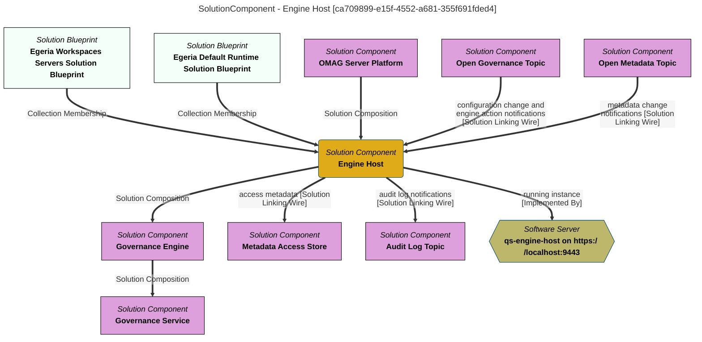

```mermaid
---
title: SolutionComponent - Engine Host [ca709899-e15f-4552-a681-355f691fded4]
---
flowchart TD
%%{init: {"flowchart": {"htmlLabels": false}} }%%

1@{ shape: rounded, label: "*Solution Component*
**Engine Host**"}
2@{ shape: rect, label: "*Solution Blueprint*
**Egeria Workspaces Servers Solution Blueprint**"}
2==>|"Collection Membership"|1
3@{ shape: rect, label: "*Solution Blueprint*
**Egeria Default Runtime Solution Blueprint**"}
3==>|"Collection Membership"|1
4@{ shape: rect, label: "*Solution Component*
**Governance Engine**"}
1==>|"Solution Composition"|4
5@{ shape: rect, label: "*Solution Component*
**Governance Service**"}
4==>|"Solution Composition"|5
6@{ shape: rect, label: "*Solution Component*
**OMAG Server Platform**"}
6==>|"Solution Composition"|1
7@{ shape: rect, label: "*Solution Component*
**Open Governance Topic**"}
7==>|"configuration change and engine action notifications [Solution Linking Wire]"|1
8@{ shape: rect, label: "*Solution Component*
**Metadata Access Store**"}
1==>|"access metadata [Solution Linking Wire]"|8
9@{ shape: rect, label: "*Solution Component*
**Audit Log Topic**"}
1==>|"audit log notifications [Solution Linking Wire]"|9
10@{ shape: rect, label: "*Solution Component*
**Open Metadata Topic**"}
10==>|"metadata change notifications [Solution Linking Wire]"|1
11@{ shape: hex, label: "*Software Server*
**qs-engine-host on https:/ /localhost:9443**"}
1==>|"running instance [Implemented By]"|11
style 11 color:#000000, fill:#bdb76b, stroke:#004563
style 1 color:#000000, fill:#e0ab18, stroke:#004563
style 2 color:#000000, fill:#f5fffa, stroke:#000000
style 3 color:#000000, fill:#f5fffa, stroke:#000000
style 4 color:#000000, fill:#dda0dd, stroke:#000000
style 5 color:#000000, fill:#dda0dd, stroke:#000000
style 6 color:#000000, fill:#dda0dd, stroke:#000000
style 7 color:#000000, fill:#dda0dd, stroke:#000000
style 8 color:#000000, fill:#dda0dd, stroke:#000000
style 9 color:#000000, fill:#dda0dd, stroke:#000000
style 10 color:#000000, fill:#dda0dd, stroke:#000000
click 11 "https://egeria-project.org/concepts/engine-host/" "Click for more documentation" _blank
click 1 "https://egeria-project.org/concepts/engine-host/" "Click for more documentation" _blank
click 4 "https://egeria-project.org/concepts/governance-engine/" "Click for more documentation" _blank
click 5 "https://egeria-project.org/concepts/governance-service/" "Click for more documentation" _blank
click 6 "https://egeria-project.org/concepts/omag-server-platform/" "Click for more documentation" _blank
click 7 "https://egeria-project.org/concepts/open-metadata-topic-connector/" "Click for more documentation" _blank
click 8 "https://egeria-project.org/concepts/metadata-access-store/" "Click for more documentation" _blank
click 9 "https://egeria-project.org/concepts/audit-log-destination-connector/" "Click for more documentation" _blank
click 10 "https://egeria-project.org/concepts/open-metadata-topic-connector/" "Click for more documentation" _blank
```
> Engine Host: A server that runs governance engines. (Extracted from 6.0-SNAPSHOT)
