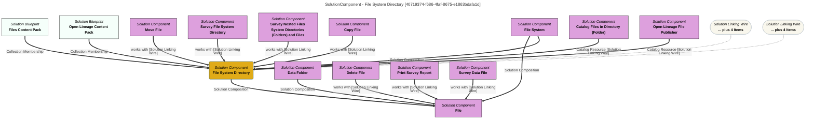

```mermaid
---
title: SolutionComponent - File System Directory [40719374-f686-4faf-8675-e1863bdafa1d]
---
flowchart TD
%%{init: {"flowchart": {"htmlLabels": false}} }%%

1@{ shape: rounded, label: "*Solution Component*
**File System Directory**"}
2@{ shape: rect, label: "*Solution Blueprint*
**Files Content Pack**"}
2==>|"Collection Membership"|1
3@{ shape: rect, label: "*Solution Blueprint*
**Open Lineage Content Pack**"}
3==>|"Collection Membership"|1
4@{ shape: rect, label: "*Solution Component*
**File**"}
1==>|"Solution Composition"|4
5@{ shape: rect, label: "*Solution Component*
**File System**"}
5==>|"Solution Composition"|4
6@{ shape: rect, label: "*Solution Component*
**Data Folder**"}
6==>|"Solution Composition"|4
7@{ shape: rect, label: "*Solution Component*
**Delete File**"}
7==>|"works with [Solution Linking Wire]"|4
8@{ shape: rect, label: "*Solution Component*
**Print Survey Report**"}
8==>|"works with [Solution Linking Wire]"|4
9@{ shape: rect, label: "*Solution Component*
**Survey Data File**"}
9==>|"works with [Solution Linking Wire]"|4
5==>|"Solution Composition"|1
10@{ shape: rect, label: "*Solution Component*
**Move File**"}
10==>|"works with [Solution Linking Wire]"|1
11@{ shape: rect, label: "*Solution Component*
**Survey File System Directory**"}
11==>|"works with [Solution Linking Wire]"|1
12@{ shape: rect, label: "*Solution Component*
**Survey Nested Files System Directories (Folders) and Files**"}
12==>|"works with [Solution Linking Wire]"|1
13@{ shape: rect, label: "*Solution Component*
**Copy File**"}
13==>|"works with [Solution Linking Wire]"|1
14@{ shape: rect, label: "*Solution Component*
**Catalog Files in Directory (Folder)**"}
14==>|"Catalog Resource [Solution Linking Wire]"|1
15@{ shape: rect, label: "*Solution Component*
**Open Lineage File Publisher**"}
15==>|"Catalog Resource [Solution Linking Wire]"|1
16@{ shape: stadium, label: "*Solution Linking Wire*
**... plus 4 Items**"}
16-.->1
17@{ shape: stadium, label: "*Solution Linking Wire*
**... plus 4 Items**"}
17-.->1
style 11 color:#000000, fill:#dda0dd, stroke:#000000
style 12 color:#000000, fill:#dda0dd, stroke:#000000
style 13 color:#000000, fill:#dda0dd, stroke:#000000
style 14 color:#000000, fill:#dda0dd, stroke:#000000
style 15 color:#000000, fill:#dda0dd, stroke:#000000
style 16 color:#000000, fill:#F9F7ED, stroke:#b7c0c7
style 17 color:#000000, fill:#F9F7ED, stroke:#b7c0c7
style 1 color:#000000, fill:#e0ab18, stroke:#004563
style 2 color:#000000, fill:#f5fffa, stroke:#000000
style 3 color:#000000, fill:#f5fffa, stroke:#000000
style 4 color:#000000, fill:#dda0dd, stroke:#000000
style 5 color:#000000, fill:#dda0dd, stroke:#000000
style 6 color:#000000, fill:#dda0dd, stroke:#000000
style 7 color:#000000, fill:#dda0dd, stroke:#000000
style 8 color:#000000, fill:#dda0dd, stroke:#000000
style 9 color:#000000, fill:#dda0dd, stroke:#000000
style 10 color:#000000, fill:#dda0dd, stroke:#000000
click 11 "https://egeria-project.org/concepts/governance-action-type/" "Click for more documentation" _blank
click 12 "https://egeria-project.org/concepts/governance-action-type/" "Click for more documentation" _blank
click 13 "https://egeria-project.org/concepts/governance-action-type/" "Click for more documentation" _blank
click 14 "https://egeria-project.org/concepts/integration-connector/" "Click for more documentation" _blank
click 15 "https://egeria-project.org/concepts/integration-connector/" "Click for more documentation" _blank
click 1 "https://egeria-project.org/types/2/0220-Files-and-Folders/" "Click for more documentation" _blank
click 4 "https://egeria-project.org/types/2/0220-Files-and-Folders/" "Click for more documentation" _blank
click 5 "https://egeria-project.org/types/0/0056-Resource-Managers/" "Click for more documentation" _blank
click 6 "https://egeria-project.org/types/2/0220-Files-and-Folders/" "Click for more documentation" _blank
click 7 "https://egeria-project.org/concepts/governance-action-type/" "Click for more documentation" _blank
click 8 "https://egeria-project.org/concepts/governance-action-type/" "Click for more documentation" _blank
click 9 "https://egeria-project.org/concepts/governance-action-type/" "Click for more documentation" _blank
click 10 "https://egeria-project.org/concepts/governance-action-type/" "Click for more documentation" _blank
```
> File System Directory: A directory (folder) that holds files that are potential data sources in a file system. (Extracted from 6.0-SNAPSHOT)
