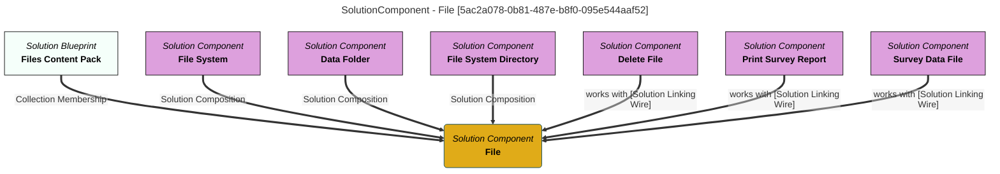

```mermaid
---
title: SolutionComponent - File [5ac2a078-0b81-487e-b8f0-095e544aaf52]
---
flowchart TD
%%{init: {"flowchart": {"htmlLabels": false}} }%%

1@{ shape: rounded, label: "*Solution Component*
**File**"}
2@{ shape: rect, label: "*Solution Blueprint*
**Files Content Pack**"}
2==>|"Collection Membership"|1
3@{ shape: rect, label: "*Solution Component*
**File System**"}
3==>|"Solution Composition"|1
4@{ shape: rect, label: "*Solution Component*
**Data Folder**"}
4==>|"Solution Composition"|1
5@{ shape: rect, label: "*Solution Component*
**File System Directory**"}
5==>|"Solution Composition"|1
6@{ shape: rect, label: "*Solution Component*
**Delete File**"}
6==>|"works with [Solution Linking Wire]"|1
7@{ shape: rect, label: "*Solution Component*
**Print Survey Report**"}
7==>|"works with [Solution Linking Wire]"|1
8@{ shape: rect, label: "*Solution Component*
**Survey Data File**"}
8==>|"works with [Solution Linking Wire]"|1
style 1 color:#000000, fill:#e0ab18, stroke:#004563
style 2 color:#000000, fill:#f5fffa, stroke:#000000
style 3 color:#000000, fill:#dda0dd, stroke:#000000
style 4 color:#000000, fill:#dda0dd, stroke:#000000
style 5 color:#000000, fill:#dda0dd, stroke:#000000
style 6 color:#000000, fill:#dda0dd, stroke:#000000
style 7 color:#000000, fill:#dda0dd, stroke:#000000
style 8 color:#000000, fill:#dda0dd, stroke:#000000
click 1 "https://egeria-project.org/types/2/0220-Files-and-Folders/" "Click for more documentation" _blank
click 3 "https://egeria-project.org/types/0/0056-Resource-Managers/" "Click for more documentation" _blank
click 4 "https://egeria-project.org/types/2/0220-Files-and-Folders/" "Click for more documentation" _blank
click 5 "https://egeria-project.org/types/2/0220-Files-and-Folders/" "Click for more documentation" _blank
click 6 "https://egeria-project.org/concepts/governance-action-type/" "Click for more documentation" _blank
click 7 "https://egeria-project.org/concepts/governance-action-type/" "Click for more documentation" _blank
click 8 "https://egeria-project.org/concepts/governance-action-type/" "Click for more documentation" _blank
```
> File: A description of a file stored in a file system. (Extracted from 6.0-SNAPSHOT)
