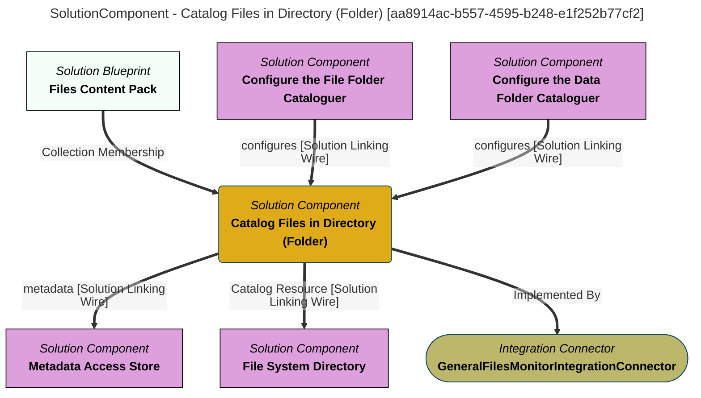

> Catalog Files in Directory (Folder): Create an open metadata representation of the files in the directories linked to this connector through the CatalogTarget relationship. (Extracted from 6.0-SNAPSHOT)
