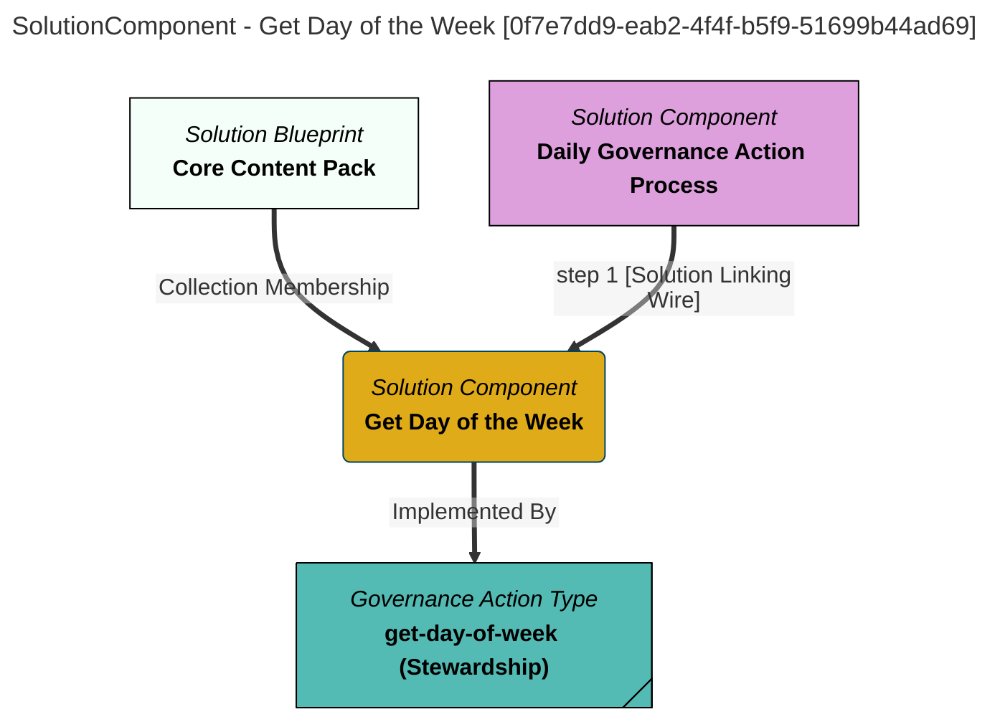

```mermaid
---
title: SolutionComponent - Get Day of the Week [0f7e7dd9-eab2-4f4f-b5f9-51699b44ad69]
---
flowchart TD
%%{init: {"flowchart": {"htmlLabels": false}} }%%

1@{ shape: rounded, label: "*Solution Component*
**Get Day of the Week**"}
2@{ shape: rect, label: "*Solution Blueprint*
**Core Content Pack**"}
2==>|"Collection Membership"|1
3@{ shape: rect, label: "*Solution Component*
**Daily Governance Action Process**"}
3==>|"step 1 [Solution Linking Wire]"|1
4@{ shape: tag-rect, label: "*Governance Action Type*
**get-day-of-week (Stewardship)**"}
1==>|"Implemented By"|4
style 1 color:#000000, fill:#e0ab18, stroke:#004563
style 2 color:#000000, fill:#f5fffa, stroke:#000000
style 3 color:#000000, fill:#dda0dd, stroke:#000000
style 4 color:#000000, fill:#53bbb4, stroke:#000000
click 1 "https://egeria-project.org/concepts/governance-action-type/" "Click for more documentation" _blank
click 3 "https://egeria-project.org/concepts/guard/" "Click for more documentation" _blank
```
> Get Day of the Week: Determine the day of the week and output it as a guard. (Extracted from 6.0-SNAPSHOT)
