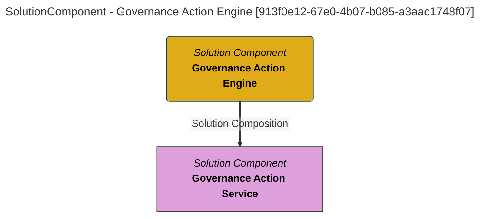

```mermaid
---
title: SolutionComponent - Governance Action Engine [913f0e12-67e0-4b07-b085-a3aac1748f07]
---
flowchart TD
%%{init: {"flowchart": {"htmlLabels": false}} }%%

1@{ shape: rounded, label: "*Solution Component*
**Governance Action Engine**"}
2@{ shape: rect, label: "*Solution Component*
**Governance Action Service**"}
1==>|"Solution Composition"|2
style 1 color:#000000, fill:#e0ab18, stroke:#004563
style 2 color:#000000, fill:#dda0dd, stroke:#000000
click 1 "https://egeria-project.org/concepts/governance-action-engine/" "Click for more documentation" _blank
click 2 "https://egeria-project.org/concepts/governance-action-service/" "Click for more documentation" _blank
```
> Governance Action Engine: A governance engine that runs governance action services. (Extracted from 6.0-SNAPSHOT)
