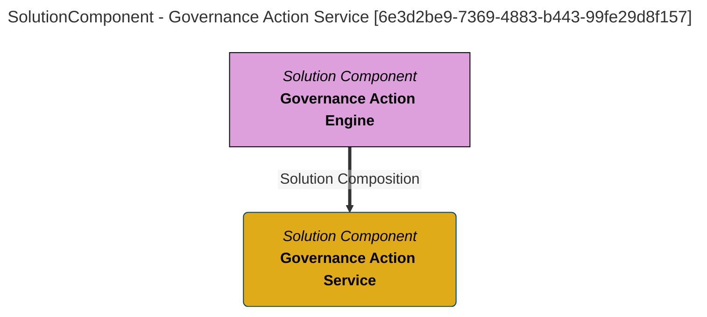

```mermaid
---
title: SolutionComponent - Governance Action Service [6e3d2be9-7369-4883-b443-99fe29d8f157]
---
flowchart TD
%%{init: {"flowchart": {"htmlLabels": false}} }%%

1@{ shape: rounded, label: "*Solution Component*
**Governance Action Service**"}
2@{ shape: rect, label: "*Solution Component*
**Governance Action Engine**"}
2==>|"Solution Composition"|1
style 1 color:#000000, fill:#e0ab18, stroke:#004563
style 2 color:#000000, fill:#dda0dd, stroke:#000000
click 1 "https://egeria-project.org/concepts/governance-action-service/" "Click for more documentation" _blank
click 2 "https://egeria-project.org/concepts/governance-action-engine/" "Click for more documentation" _blank
```
> Governance Action Service: A connector that coordinates governance of digital resources and metadata. (Extracted from 6.0-SNAPSHOT)
