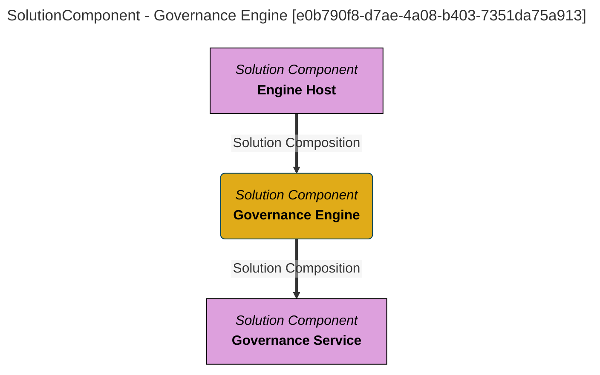

```mermaid
---
title: SolutionComponent - Governance Engine [e0b790f8-d7ae-4a08-b403-7351da75a913]
---
flowchart TD
%%{init: {"flowchart": {"htmlLabels": false}} }%%

1@{ shape: rounded, label: "*Solution Component*
**Governance Engine**"}
2@{ shape: rect, label: "*Solution Component*
**Governance Service**"}
1==>|"Solution Composition"|2
3@{ shape: rect, label: "*Solution Component*
**Engine Host**"}
3==>|"Solution Composition"|1
style 1 color:#000000, fill:#e0ab18, stroke:#004563
style 2 color:#000000, fill:#dda0dd, stroke:#000000
style 3 color:#000000, fill:#dda0dd, stroke:#000000
click 1 "https://egeria-project.org/concepts/governance-engine/" "Click for more documentation" _blank
click 2 "https://egeria-project.org/concepts/governance-service/" "Click for more documentation" _blank
click 3 "https://egeria-project.org/concepts/engine-host/" "Click for more documentation" _blank
```
> Governance Engine: Manages the execution of automated governance activity requested via engine actions. (Extracted from 6.0-SNAPSHOT)
