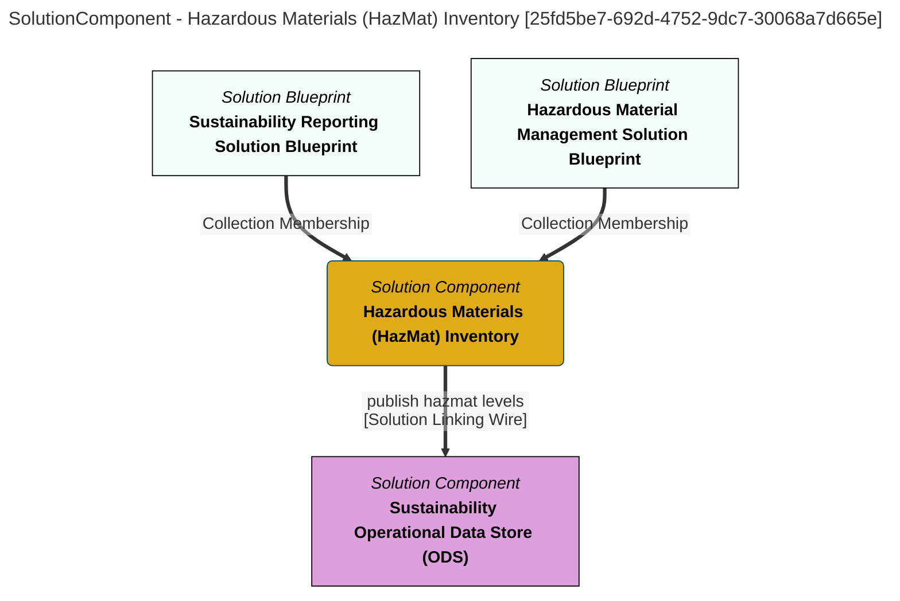

```mermaid
---
title: SolutionComponent - Hazardous Materials (HazMat) Inventory [25fd5be7-692d-4752-9dc7-30068a7d665e]
---
flowchart TD
%%{init: {"flowchart": {"htmlLabels": false}} }%%

1@{ shape: rounded, label: "*Solution Component*
**Hazardous Materials (HazMat) Inventory**"}
2@{ shape: rect, label: "*Solution Blueprint*
**Sustainability Reporting Solution Blueprint**"}
2==>|"Collection Membership"|1
3@{ shape: rect, label: "*Solution Blueprint*
**Hazardous Material Management Solution Blueprint**"}
3==>|"Collection Membership"|1
4@{ shape: rect, label: "*Solution Component*
**Sustainability Operational Data Store (ODS)**"}
1==>|"publish hazmat levels [Solution Linking Wire]"|4
style 1 color:#000000, fill:#e0ab18, stroke:#004563
style 2 color:#000000, fill:#f5fffa, stroke:#000000
style 3 color:#000000, fill:#f5fffa, stroke:#000000
style 4 color:#000000, fill:#dda0dd, stroke:#000000
```
> Hazardous Materials (HazMat) Inventory: Application for recording and tracing hazardous materials.  This includes greenhouse gasses such as CO2 and Hydro-fluorocarbons. (Extracted from V1.0)
