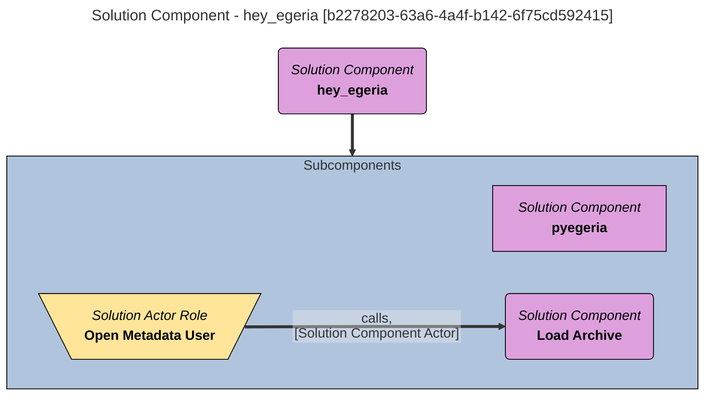

```mermaid
---
title: Solution Component - hey_egeria [b2278203-63a6-4a4f-b142-6f75cd592415]
---
flowchart TD
%%{init: {"flowchart": {"htmlLabels": false}} }%%

1@{ shape: rounded, label: "*Solution Component*
**hey_egeria**"}
subgraph 2 [Subcomponents]
3@{ shape: rect, label: "*Solution Component*
**pyegeria**"}
4@{ shape: rounded, label: "*Solution Component*
**Load Archive**"}
5@{ shape: trap-t, label: "*Solution Actor Role*
**Open Metadata User**"}
5==>|"calls,
[Solution Component Actor]"|4
end
1==>2
style 1 color:#000000, fill:#dda0dd, stroke:#000000
style 2 color:#000000, fill:#b0c4de, stroke:#000000
style 3 color:#000000, fill:#dda0dd, stroke:#000000
style 4 color:#000000, fill:#dda0dd, stroke:#000000
style 5 color:#000000, fill:#FFE599, stroke:#000000
click 1 "https://egeria-project.org/user-interfaces/hey-egeria/overview/" "Click for more documentation" _blank
click 3 "https://egeria-project.org/concepts/pyegeria/" "Click for more documentation" _blank
click 4 "https://egeria-project.org/concepts/open-metadata-archive/" "Click for more documentation" _blank
```
> hey_egeria: A user interface for working with Egeria and open metadata. (Extracted from 6.0-SNAPSHOT)
