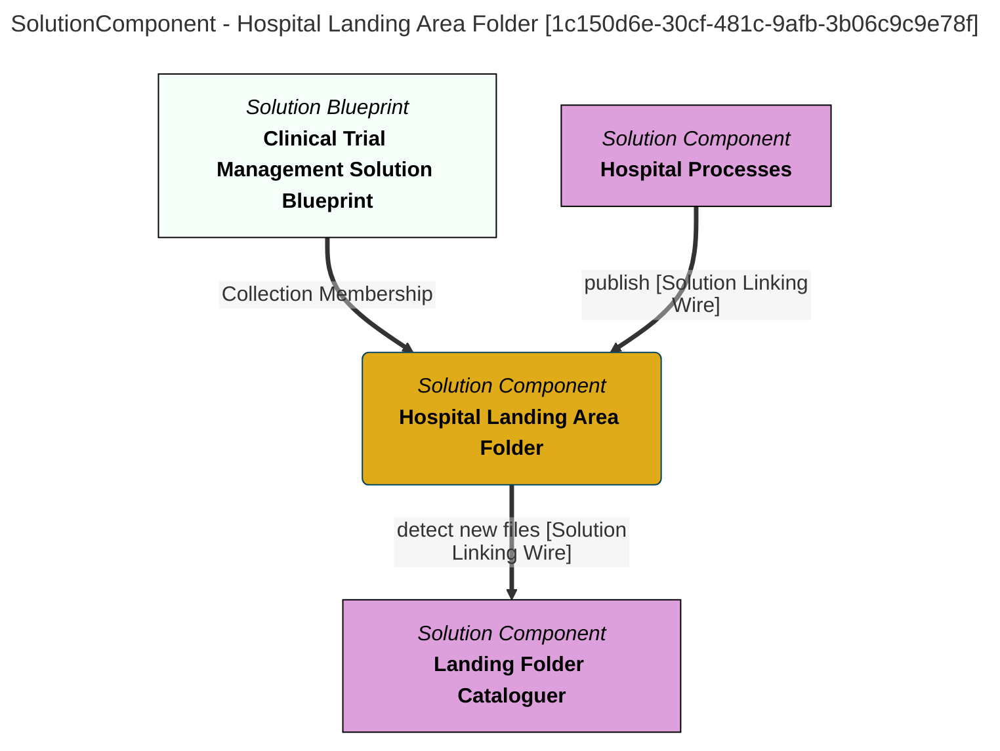

```mermaid
---
title: SolutionComponent - Hospital Landing Area Folder [1c150d6e-30cf-481c-9afb-3b06c9c9e78f]
---
flowchart TD
%%{init: {"flowchart": {"htmlLabels": false}} }%%

1@{ shape: rounded, label: "*Solution Component*
**Hospital Landing Area Folder**"}
2@{ shape: rect, label: "*Solution Blueprint*
**Clinical Trial Management Solution Blueprint**"}
2==>|"Collection Membership"|1
3@{ shape: rect, label: "*Solution Component*
**Landing Folder Cataloguer**"}
1==>|"detect new files [Solution Linking Wire]"|3
4@{ shape: rect, label: "*Solution Component*
**Hospital Processes**"}
4==>|"publish [Solution Linking Wire]"|1
style 1 color:#000000, fill:#e0ab18, stroke:#004563
style 2 color:#000000, fill:#f5fffa, stroke:#000000
style 3 color:#000000, fill:#dda0dd, stroke:#000000
style 4 color:#000000, fill:#dda0dd, stroke:#000000
```
> Hospital Landing Area Folder: Destination for incoming files from a particular hospital. (Extracted from V1.0)
