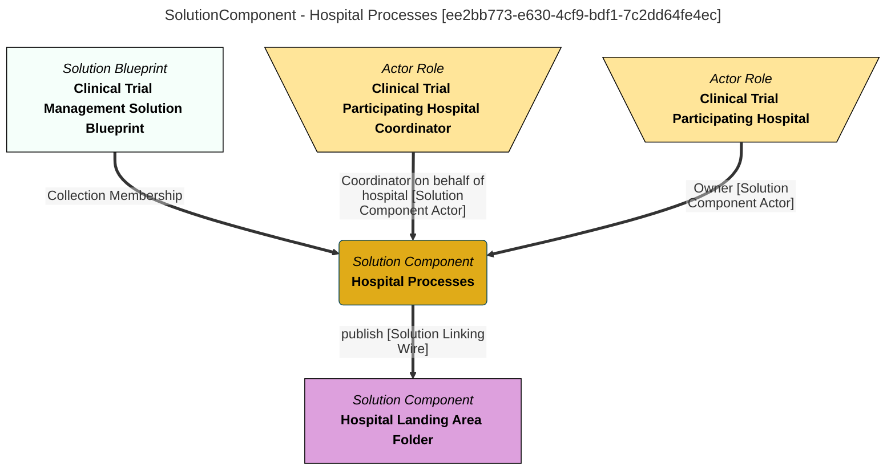

```mermaid
---
title: SolutionComponent - Hospital Processes [ee2bb773-e630-4cf9-bdf1-7c2dd64fe4ec]
---
flowchart TD
%%{init: {"flowchart": {"htmlLabels": false}} }%%

1@{ shape: rounded, label: "*Solution Component*
**Hospital Processes**"}
2@{ shape: rect, label: "*Solution Blueprint*
**Clinical Trial Management Solution Blueprint**"}
2==>|"Collection Membership"|1
3@{ shape: trap-t, label: "*Actor Role*
**Clinical Trial Participating Hospital Coordinator**"}
3==>|"Coordinator on behalf of hospital [Solution Component Actor]"|1
4@{ shape: trap-t, label: "*Actor Role*
**Clinical Trial Participating Hospital**"}
4==>|"Owner [Solution Component Actor]"|1
5@{ shape: rect, label: "*Solution Component*
**Hospital Landing Area Folder**"}
1==>|"publish [Solution Linking Wire]"|5
style 1 color:#000000, fill:#e0ab18, stroke:#004563
style 2 color:#000000, fill:#f5fffa, stroke:#000000
style 3 color:#000000, fill:#FFE599, stroke:#000000
style 4 color:#000000, fill:#FFE599, stroke:#000000
style 5 color:#000000, fill:#dda0dd, stroke:#000000
```
> Hospital Processes: Processes running in the hospital that negotiate data sharing agreements, recruit patients, train staff and deliver data. (Extracted from V1.0)
