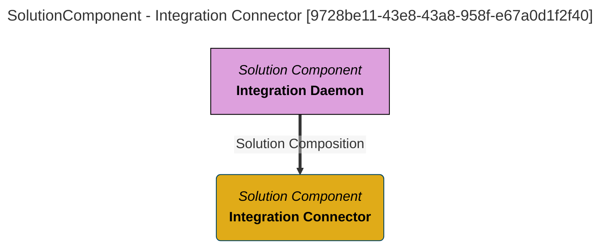

```mermaid
---
title: SolutionComponent - Integration Connector [9728be11-43e8-43a8-958f-e67a0d1f2f40]
---
flowchart TD
%%{init: {"flowchart": {"htmlLabels": false}} }%%

1@{ shape: rounded, label: "*Solution Component*
**Integration Connector**"}
2@{ shape: rect, label: "*Solution Component*
**Integration Daemon**"}
2==>|"Solution Composition"|1
style 1 color:#000000, fill:#e0ab18, stroke:#004563
style 2 color:#000000, fill:#dda0dd, stroke:#000000
click 1 "https://egeria-project.org/services/omvs/analytics-integrator/overview" "Click for more documentation" _blank
click 2 "https://egeria-project.org/concepts/integration-daemon/" "Click for more documentation" _blank
```
> Integration Connector: Connector that manages metadata exchange with a third party technology. (Extracted from 6.0-SNAPSHOT)
