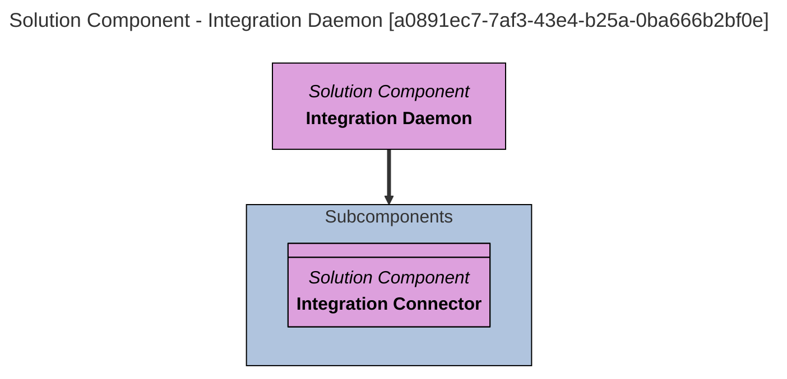

```mermaid
---
title: Solution Component - Integration Daemon [a0891ec7-7af3-43e4-b25a-0ba666b2bf0e]
---
flowchart TD
%%{init: {"flowchart": {"htmlLabels": false}} }%%

1@{ shape: rect, label: "*Solution Component*
**Integration Daemon**"}
subgraph 2 [Subcomponents]
3@{ shape: div-rect, label: "*Solution Component*
**Integration Connector**"}
end
1==>2
style 1 color:#000000, fill:#dda0dd, stroke:#000000
style 2 color:#000000, fill:#b0c4de, stroke:#000000
style 3 color:#000000, fill:#dda0dd, stroke:#000000
click 1 "https://egeria-project.org/concepts/integration-daemon/" "Click for more documentation" _blank
click 3 "https://egeria-project.org/services/omvs/analytics-integrator/overview" "Click for more documentation" _blank
```
> Integration Daemon: A server that runs integration connectors that synchronize metadata between different types of technologies. (Extracted from 6.0-SNAPSHOT)
