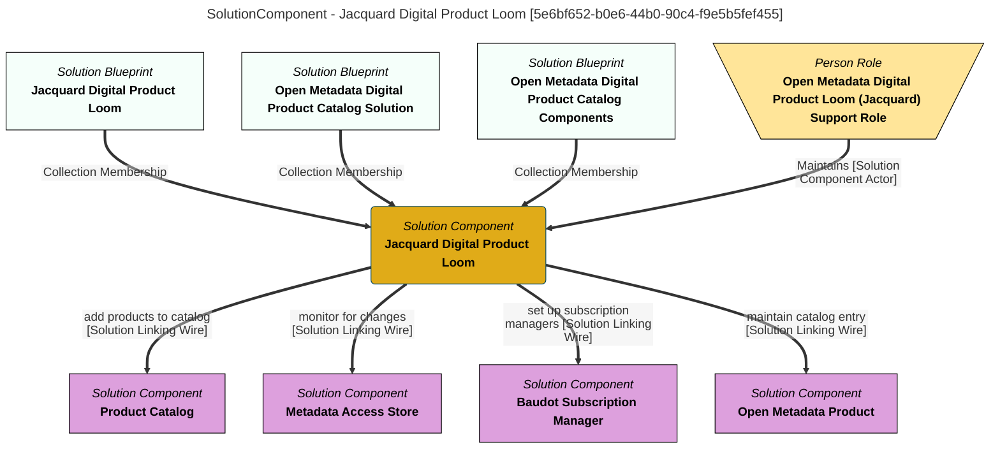

> Jacquard Digital Product Loom: Defines and maintains digital products based on the content of the open metadata repositories.  These products are assembled into a digital product catalog along with a glossary and data dictionary.  This integration connector is started when the Open Metadata Digital Product Archive is loaded.  It is responsible for detecting opportunities for open metadata digital products, creating a catalog entry for them and then maintaining last update information in the product information.  This is used to drive the distribution of open metadata updates to subscribers. (Extracted from 6.0-SNAPSHOT)
