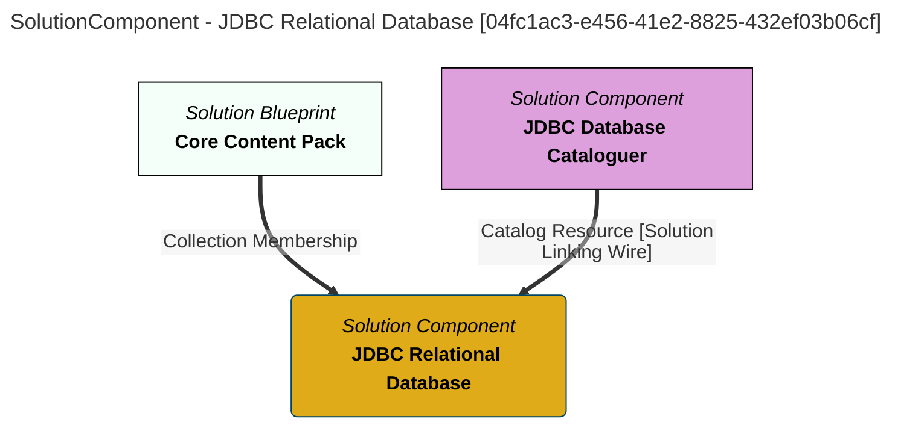

```mermaid
---
title: SolutionComponent - JDBC Relational Database [04fc1ac3-e456-41e2-8825-432ef03b06cf]
---
flowchart TD
%%{init: {"flowchart": {"htmlLabels": false}} }%%

1@{ shape: rounded, label: "*Solution Component*
**JDBC Relational Database**"}
2@{ shape: rect, label: "*Solution Blueprint*
**Core Content Pack**"}
2==>|"Collection Membership"|1
3@{ shape: rect, label: "*Solution Component*
**JDBC Database Cataloguer**"}
3==>|"Catalog Resource [Solution Linking Wire]"|1
style 1 color:#000000, fill:#e0ab18, stroke:#004563
style 2 color:#000000, fill:#f5fffa, stroke:#000000
style 3 color:#000000, fill:#dda0dd, stroke:#000000
click 1 "https://en.wikipedia.org/wiki/Java_Database_Connectivity" "Click for more documentation" _blank
click 3 "https://egeria-project.org/concepts/integration-connector/" "Click for more documentation" _blank
```
> JDBC Relational Database: A database hosted on a relational database server callable through a JDBC Driver. (Extracted from 6.0-SNAPSHOT)
