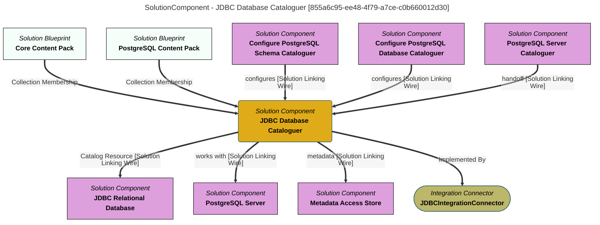

```mermaid
---
title: SolutionComponent - JDBC Database Cataloguer [855a6c95-ee48-4f79-a7ce-c0b660012d30]
---
flowchart TD
%%{init: {"flowchart": {"htmlLabels": false}} }%%

1@{ shape: rounded, label: "*Solution Component*
**JDBC Database Cataloguer**"}
2@{ shape: rect, label: "*Solution Blueprint*
**Core Content Pack**"}
2==>|"Collection Membership"|1
3@{ shape: rect, label: "*Solution Blueprint*
**PostgreSQL Content Pack**"}
3==>|"Collection Membership"|1
4@{ shape: rect, label: "*Solution Component*
**JDBC Relational Database**"}
1==>|"Catalog Resource [Solution Linking Wire]"|4
5@{ shape: rect, label: "*Solution Component*
**PostgreSQL Server**"}
1==>|"works with [Solution Linking Wire]"|5
6@{ shape: rect, label: "*Solution Component*
**Metadata Access Store**"}
1==>|"metadata [Solution Linking Wire]"|6
7@{ shape: rect, label: "*Solution Component*
**Configure PostgreSQL Schema Cataloguer**"}
7==>|"configures [Solution Linking Wire]"|1
8@{ shape: rect, label: "*Solution Component*
**Configure PostgreSQL Database Cataloguer**"}
8==>|"configures [Solution Linking Wire]"|1
9@{ shape: rect, label: "*Solution Component*
**PostgreSQL Server Cataloguer**"}
9==>|"handoff [Solution Linking Wire]"|1
10@{ shape: stadium, label: "*Integration Connector*
**JDBCIntegrationConnector**"}
1==>|"Implemented By"|10
style 1 color:#000000, fill:#e0ab18, stroke:#004563
style 2 color:#000000, fill:#f5fffa, stroke:#000000
style 3 color:#000000, fill:#f5fffa, stroke:#000000
style 4 color:#000000, fill:#dda0dd, stroke:#000000
style 5 color:#000000, fill:#dda0dd, stroke:#000000
style 6 color:#000000, fill:#dda0dd, stroke:#000000
style 7 color:#000000, fill:#dda0dd, stroke:#000000
style 8 color:#000000, fill:#dda0dd, stroke:#000000
style 9 color:#000000, fill:#dda0dd, stroke:#000000
style 10 color:#000000, fill:#bdb76b, stroke:#004563
click 1 "https://egeria-project.org/concepts/integration-connector/" "Click for more documentation" _blank
click 4 "https://en.wikipedia.org/wiki/Java_Database_Connectivity" "Click for more documentation" _blank
click 5 "https://www.postgresql.org/" "Click for more documentation" _blank
click 6 "https://egeria-project.org/concepts/metadata-access-store/" "Click for more documentation" _blank
click 7 "https://egeria-project.org/concepts/governance-action-type/" "Click for more documentation" _blank
click 8 "https://egeria-project.org/concepts/governance-action-type/" "Click for more documentation" _blank
click 9 "https://egeria-project.org/concepts/integration-connector/" "Click for more documentation" _blank
```
> JDBC Database Cataloguer: Maintains the open metadata elements that represent the schemas, tables and columns in a JDBC relational database. (Extracted from 6.0-SNAPSHOT)
