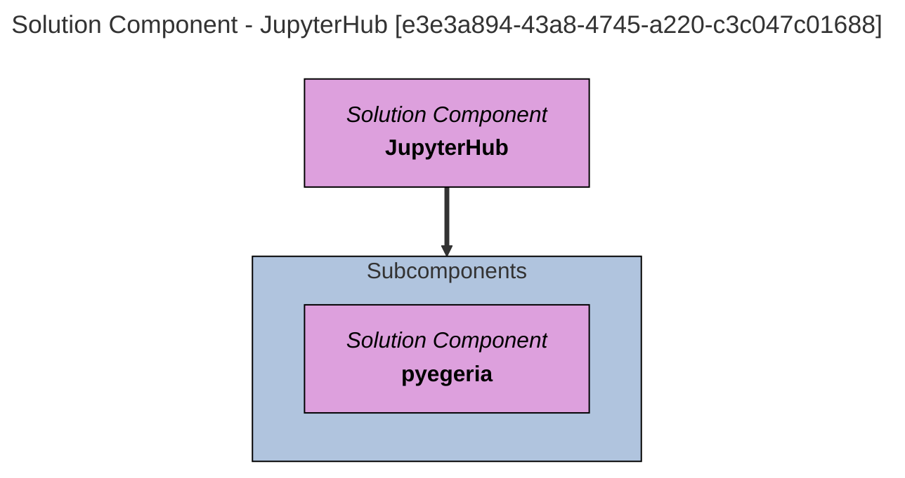

```mermaid
---
title: Solution Component - JupyterHub [e3e3a894-43a8-4745-a220-c3c047c01688]
---
flowchart TD
%%{init: {"flowchart": {"htmlLabels": false}} }%%

1@{ shape: rect, label: "*Solution Component*
**JupyterHub**"}
subgraph 2 [Subcomponents]
3@{ shape: rect, label: "*Solution Component*
**pyegeria**"}
end
1==>2
style 1 color:#000000, fill:#dda0dd, stroke:#000000
style 2 color:#000000, fill:#b0c4de, stroke:#000000
style 3 color:#000000, fill:#dda0dd, stroke:#000000
click 1 "https://jupyter.org/hub" "Click for more documentation" _blank
click 3 "https://egeria-project.org/concepts/pyegeria/" "Click for more documentation" _blank
```
> JupyterHub: Supports browser based interaction with Jupyter Notebooks. (Extracted from 6.0-SNAPSHOT)
