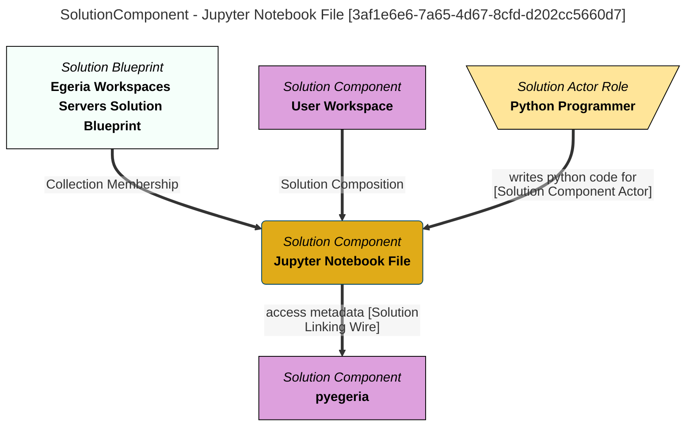

```mermaid
---
title: SolutionComponent - Jupyter Notebook File [3af1e6e6-7a65-4d67-8cfd-d202cc5660d7]
---
flowchart TD
%%{init: {"flowchart": {"htmlLabels": false}} }%%

1@{ shape: rounded, label: "*Solution Component*
**Jupyter Notebook File**"}
2@{ shape: rect, label: "*Solution Blueprint*
**Egeria Workspaces Servers Solution Blueprint**"}
2==>|"Collection Membership"|1
3@{ shape: rect, label: "*Solution Component*
**User Workspace**"}
3==>|"Solution Composition"|1
4@{ shape: trap-t, label: "*Solution Actor Role*
**Python Programmer**"}
4==>|"writes python code for [Solution Component Actor]"|1
5@{ shape: rect, label: "*Solution Component*
**pyegeria**"}
1==>|"access metadata [Solution Linking Wire]"|5
style 1 color:#000000, fill:#e0ab18, stroke:#004563
style 2 color:#000000, fill:#f5fffa, stroke:#000000
style 3 color:#000000, fill:#dda0dd, stroke:#000000
style 4 color:#000000, fill:#FFE599, stroke:#000000
style 5 color:#000000, fill:#dda0dd, stroke:#000000
click 1 "https://jupyter.org/" "Click for more documentation" _blank
click 5 "https://egeria-project.org/concepts/pyegeria/" "Click for more documentation" _blank
```
> Jupyter Notebook File: Text file encoded in JSON that describes a mixture of python code and descriptive text. (Extracted from 6.0-SNAPSHOT)
