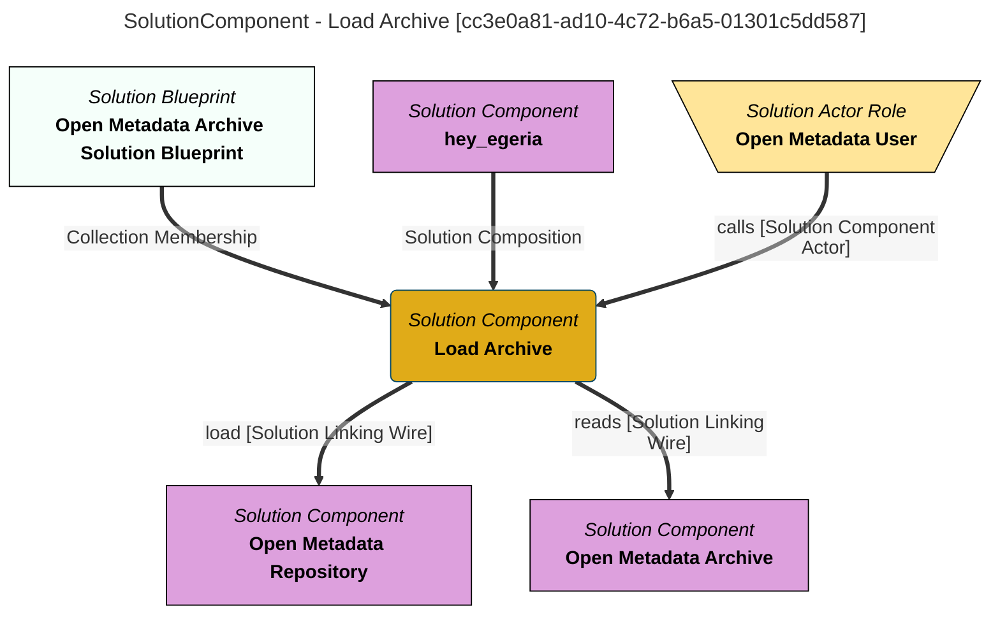

```mermaid
---
title: SolutionComponent - Load Archive [cc3e0a81-ad10-4c72-b6a5-01301c5dd587]
---
flowchart TD
%%{init: {"flowchart": {"htmlLabels": false}} }%%

1@{ shape: rounded, label: "*Solution Component*
**Load Archive**"}
2@{ shape: rect, label: "*Solution Blueprint*
**Open Metadata Archive Solution Blueprint**"}
2==>|"Collection Membership"|1
3@{ shape: rect, label: "*Solution Component*
**hey_egeria**"}
3==>|"Solution Composition"|1
4@{ shape: trap-t, label: "*Solution Actor Role*
**Open Metadata User**"}
4==>|"calls [Solution Component Actor]"|1
5@{ shape: rect, label: "*Solution Component*
**Open Metadata Repository**"}
1==>|"load [Solution Linking Wire]"|5
6@{ shape: rect, label: "*Solution Component*
**Open Metadata Archive**"}
1==>|"reads [Solution Linking Wire]"|6
style 1 color:#000000, fill:#e0ab18, stroke:#004563
style 2 color:#000000, fill:#f5fffa, stroke:#000000
style 3 color:#000000, fill:#dda0dd, stroke:#000000
style 4 color:#000000, fill:#FFE599, stroke:#000000
style 5 color:#000000, fill:#dda0dd, stroke:#000000
style 6 color:#000000, fill:#dda0dd, stroke:#000000
click 1 "https://egeria-project.org/concepts/open-metadata-archive/" "Click for more documentation" _blank
click 3 "https://egeria-project.org/user-interfaces/hey-egeria/overview/" "Click for more documentation" _blank
click 5 "https://egeria-project.org/concepts/open-metadata-repository/" "Click for more documentation" _blank
click 6 "https://egeria-project.org/concepts/open-metadata-archive/" "Click for more documentation" _blank
```
> Load Archive: A command to load an open metadata archive. (Extracted from 6.0-SNAPSHOT)
