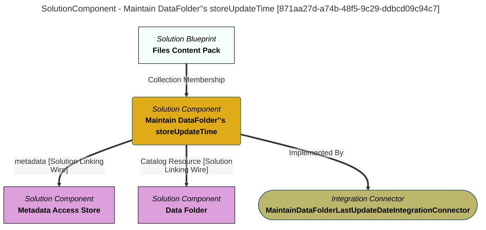

> Maintain DataFolder''s storeUpdateTime: Monitors changes to the files in the directory associated with a DataFolder and maintains the storeUpdateTime attribute in the DataFolder with the data/time that ome of the files was created/changed. (Extracted from 6.0-SNAPSHOT)
