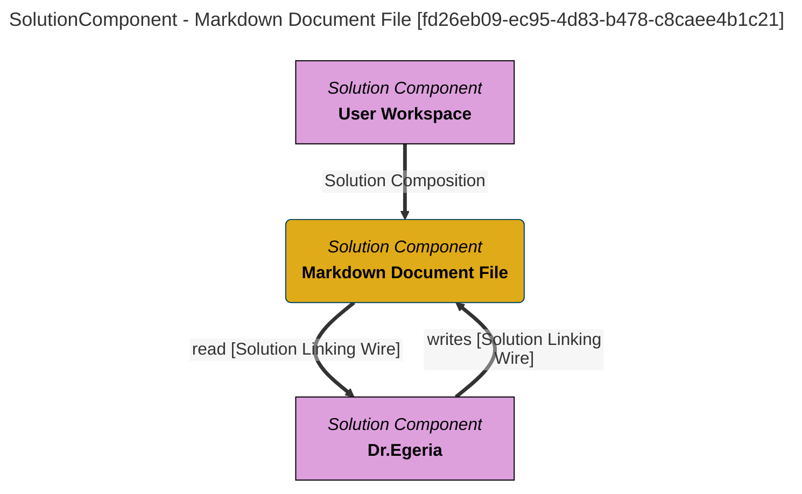

```mermaid
---
title: SolutionComponent - Markdown Document File [fd26eb09-ec95-4d83-b478-c8caee4b1c21]
---
flowchart TD
%%{init: {"flowchart": {"htmlLabels": false}} }%%

1@{ shape: rounded, label: "*Solution Component*
**Markdown Document File**"}
2@{ shape: rect, label: "*Solution Component*
**User Workspace**"}
2==>|"Solution Composition"|1
3@{ shape: rect, label: "*Solution Component*
**Dr.Egeria**"}
1==>|"read [Solution Linking Wire]"|3
3==>|"writes [Solution Linking Wire]"|1
style 1 color:#000000, fill:#e0ab18, stroke:#004563
style 2 color:#000000, fill:#dda0dd, stroke:#000000
style 3 color:#000000, fill:#dda0dd, stroke:#000000
click 1 "https://en.wikipedia.org/wiki/Markdown" "Click for more documentation" _blank
```
> Markdown Document File: Text file encoded using markdown tags and layout. (Extracted from 6.0-SNAPSHOT)
