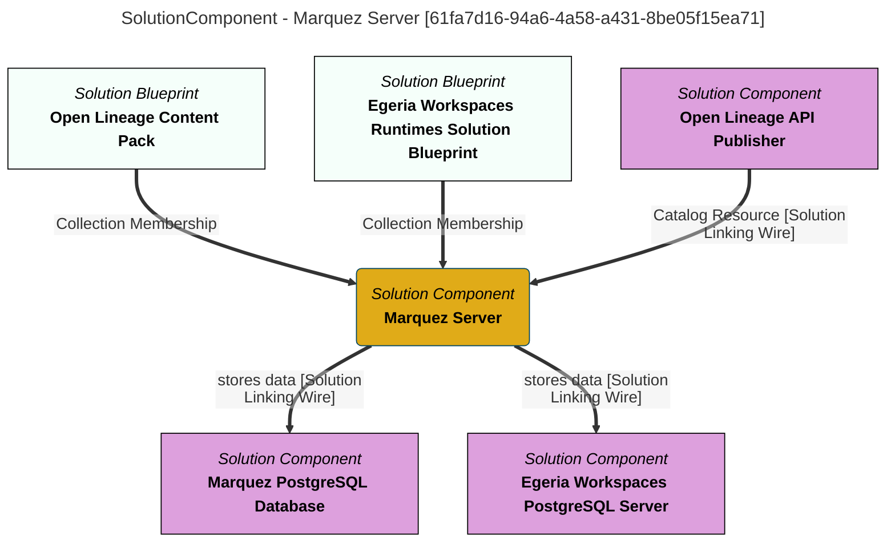

```mermaid
---
title: SolutionComponent - Marquez Server [61fa7d16-94a6-4a58-a431-8be05f15ea71]
---
flowchart TD
%%{init: {"flowchart": {"htmlLabels": false}} }%%

1@{ shape: rounded, label: "*Solution Component*
**Marquez Server**"}
2@{ shape: rect, label: "*Solution Blueprint*
**Open Lineage Content Pack**"}
2==>|"Collection Membership"|1
3@{ shape: rect, label: "*Solution Blueprint*
**Egeria Workspaces Runtimes Solution Blueprint**"}
3==>|"Collection Membership"|1
4@{ shape: rect, label: "*Solution Component*
**Marquez PostgreSQL Database**"}
1==>|"stores data [Solution Linking Wire]"|4
5@{ shape: rect, label: "*Solution Component*
**Egeria Workspaces PostgreSQL Server**"}
1==>|"stores data [Solution Linking Wire]"|5
6@{ shape: rect, label: "*Solution Component*
**Open Lineage API Publisher**"}
6==>|"Catalog Resource [Solution Linking Wire]"|1
style 1 color:#000000, fill:#e0ab18, stroke:#004563
style 2 color:#000000, fill:#f5fffa, stroke:#000000
style 3 color:#000000, fill:#f5fffa, stroke:#000000
style 4 color:#000000, fill:#dda0dd, stroke:#000000
style 5 color:#000000, fill:#dda0dd, stroke:#000000
style 6 color:#000000, fill:#dda0dd, stroke:#000000
click 1 "https://marquezproject.ai/" "Click for more documentation" _blank
click 4 "https://www.postgresql.org/" "Click for more documentation" _blank
click 5 "https://www.postgresql.org/" "Click for more documentation" _blank
click 6 "https://egeria-project.org/concepts/integration-connector/" "Click for more documentation" _blank
```
> Marquez Server: A data catalog for data observability. (Extracted from 6.0-SNAPSHOT)
