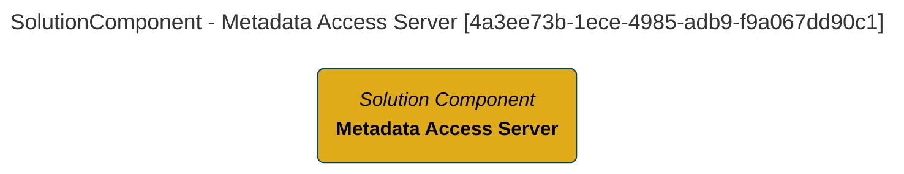

```mermaid
---
title: SolutionComponent - Metadata Access Server [4a3ee73b-1ece-4985-adb9-f9a067dd90c1]
---
flowchart TD
%%{init: {"flowchart": {"htmlLabels": false}} }%%

1@{ shape: rounded, label: "*Solution Component*
**Metadata Access Server**"}
style 1 color:#000000, fill:#e0ab18, stroke:#004563
click 1 "https://egeria-project.org/concepts/metadata-access-server/" "Click for more documentation" _blank
```
> Metadata Access Server: A server that provides access to one or more open metadata repositories. (Extracted from 6.0-SNAPSHOT)
