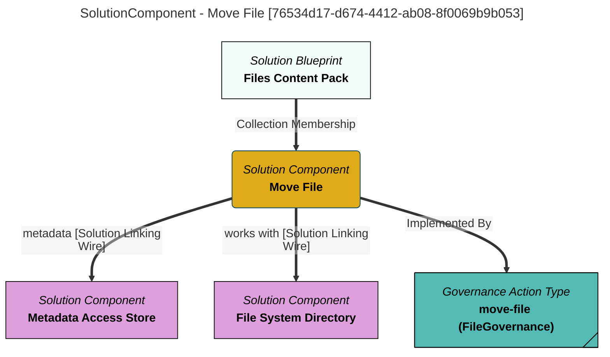

> Move File: Move a file from one directory to another and maintain the open metadata elements describing the two locations of the file and the lineage representing the data flow between them. (Extracted from 6.0-SNAPSHOT)
