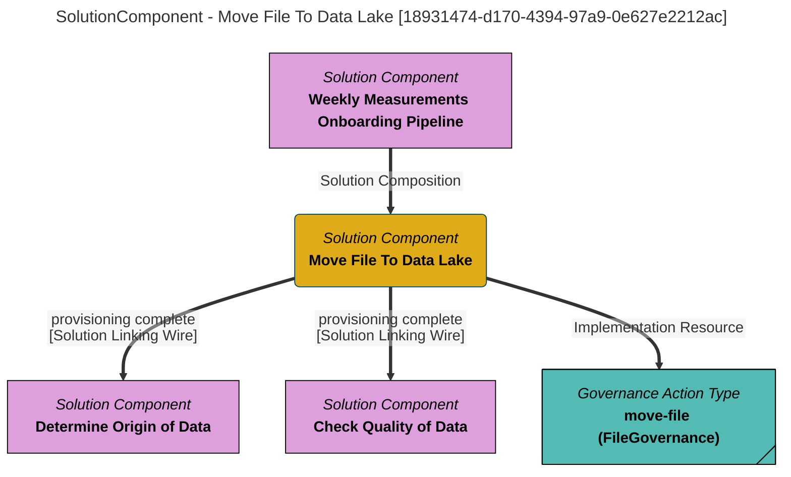

> Move File To Data Lake: Move landing area files to data lake, catalog files in data lake with lineage from the landing area and validate/certify that the data contains valid values.  The cataloguing includes lineage, retention, origin, governance zones.  The quality validation survey will add a certification to the file asset if the data contains valid values. (Extracted from V1.0)
