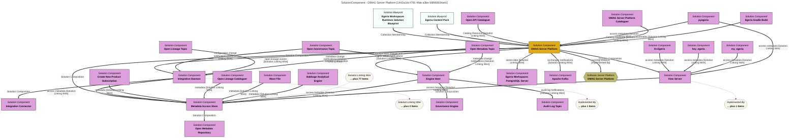

```mermaid
---
title: SolutionComponent - OMAG Server Platform [1442a1bc-f791-4fda-a3be-56fb68934a4c]
---
flowchart TD
%%{init: {"flowchart": {"htmlLabels": false}} }%%

1@{ shape: rounded, label: "*Solution Component*
**OMAG Server Platform**"}
2@{ shape: rect, label: "*Solution Blueprint*
**Egeria Workspaces Runtimes Solution Blueprint**"}
2==>|"Collection Membership"|1
3@{ shape: rect, label: "*Solution Blueprint*
**Egeria Content Pack**"}
3==>|"Collection Membership"|1
4@{ shape: rect, label: "*Solution Component*
**Integration Daemon**"}
1==>|"Solution Composition"|4
5@{ shape: rect, label: "*Solution Component*
**Integration Connector**"}
4==>|"Solution Composition"|5
6@{ shape: rect, label: "*Solution Component*
**Open Governance Topic**"}
6==>|"configuration change notifications [Solution Linking Wire]"|4
7@{ shape: rect, label: "*Solution Component*
**Open Lineage Topic**"}
7==>|"open lineage events [Solution Linking Wire]"|4
8@{ shape: rect, label: "*Solution Component*
**Metadata Access Store**"}
4==>|"access metadata [Solution Linking Wire]"|8
9@{ shape: rect, label: "*Solution Component*
**Open Metadata Topic**"}
9==>|"metadata change notifications [Solution Linking Wire]"|4
10@{ shape: stadium, label: "*Solution Linking Wire*
**... plus 2 Items**"}
4-.->10
1==>|"Solution Composition"|8
11@{ shape: rect, label: "*Solution Component*
**Open Metadata Repository**"}
8==>|"Solution Composition"|11
12@{ shape: rect, label: "*Solution Component*
**Create New Product Subscription**"}
12==>|"metadata [Solution Linking Wire]"|8
13@{ shape: rect, label: "*Solution Component*
**Open Lineage Cataloguer**"}
13==>|"metadata [Solution Linking Wire]"|8
14@{ shape: rect, label: "*Solution Component*
**Move File**"}
14==>|"metadata [Solution Linking Wire]"|8
15@{ shape: rect, label: "*Solution Component*
**Babbage Analytical Engine**"}
15==>|"metadata [Solution Linking Wire]"|8
16@{ shape: stadium, label: "*Solution Linking Wire*
**... plus 77 Items**"}
16-.->8
17@{ shape: rect, label: "*Solution Component*
**Engine Host**"}
1==>|"Solution Composition"|17
18@{ shape: rect, label: "*Solution Component*
**Governance Engine**"}
17==>|"Solution Composition"|18
6==>|"configuration change and engine action notifications [Solution Linking Wire]"|17
17==>|"access metadata [Solution Linking Wire]"|8
19@{ shape: rect, label: "*Solution Component*
**Audit Log Topic**"}
17==>|"audit log notifications [Solution Linking Wire]"|19
9==>|"metadata change notifications [Solution Linking Wire]"|17
20@{ shape: stadium, label: "*Implemented By*
**... plus 1 Items**"}
17-.->20
21@{ shape: rect, label: "*Solution Component*
**View Server**"}
1==>|"Solution Composition"|21
22@{ shape: rect, label: "*Solution Component*
**Dr.Egeria**"}
22==>|"access metadata [Solution Linking Wire]"|21
23@{ shape: rect, label: "*Solution Component*
**hey_egeria**"}
23==>|"access metadata [Solution Linking Wire]"|21
21==>|"access metadata [Solution Linking Wire]"|8
24@{ shape: rect, label: "*Solution Component*
**my_egeria**"}
24==>|"access metadata [Solution Linking Wire]"|21
25@{ shape: rect, label: "*Solution Component*
**pyegeria**"}
25==>|"access metadata [Solution Linking Wire]"|21
26@{ shape: stadium, label: "*Implemented By*
**... plus 1 Items**"}
21-.->26
27@{ shape: rect, label: "*Solution Component*
**Egeria Workspaces PostgreSQL Server**"}
1==>|"stores data [Solution Linking Wire]"|27
28@{ shape: rect, label: "*Solution Component*
**Open API Cataloguer**"}
28==>|"Catalog Resource [Solution Linking Wire]"|1
29@{ shape: rect, label: "*Solution Component*
**Apache Kafka**"}
1==>|"exchanges notifications [Solution Linking Wire]"|29
25==>|"access metadata [Solution Linking Wire]"|1
30@{ shape: rect, label: "*Solution Component*
**OMAG Server Platform Cataloguer**"}
30==>|"Catalog Resource [Solution Linking Wire]"|1
31@{ shape: rect, label: "*Solution Component*
**Egeria Gradle Build**"}
31==>|"assembles [Solution Linking Wire]"|1
32@{ shape: hex, label: "*Software Server Platform*
**OMAG Server Platform**"}
1==>|"running instance [Implemented By]"|32
style 22 color:#000000, fill:#dda0dd, stroke:#000000
style 23 color:#000000, fill:#dda0dd, stroke:#000000
style 24 color:#000000, fill:#dda0dd, stroke:#000000
style 25 color:#000000, fill:#dda0dd, stroke:#000000
style 26 color:#000000, fill:#F9F7ED, stroke:#b7c0c7
style 27 color:#000000, fill:#dda0dd, stroke:#000000
style 28 color:#000000, fill:#dda0dd, stroke:#000000
style 29 color:#000000, fill:#dda0dd, stroke:#000000
style 30 color:#000000, fill:#dda0dd, stroke:#000000
style 31 color:#000000, fill:#dda0dd, stroke:#000000
style 10 color:#000000, fill:#F9F7ED, stroke:#b7c0c7
style 32 color:#000000, fill:#bdb76b, stroke:#004563
style 11 color:#000000, fill:#dda0dd, stroke:#000000
style 12 color:#000000, fill:#dda0dd, stroke:#000000
style 13 color:#000000, fill:#dda0dd, stroke:#000000
style 14 color:#000000, fill:#dda0dd, stroke:#000000
style 15 color:#000000, fill:#dda0dd, stroke:#000000
style 16 color:#000000, fill:#F9F7ED, stroke:#b7c0c7
style 17 color:#000000, fill:#dda0dd, stroke:#000000
style 18 color:#000000, fill:#dda0dd, stroke:#000000
style 19 color:#000000, fill:#dda0dd, stroke:#000000
style 1 color:#000000, fill:#e0ab18, stroke:#004563
style 2 color:#000000, fill:#f5fffa, stroke:#000000
style 3 color:#000000, fill:#f5fffa, stroke:#000000
style 4 color:#000000, fill:#dda0dd, stroke:#000000
style 5 color:#000000, fill:#dda0dd, stroke:#000000
style 6 color:#000000, fill:#dda0dd, stroke:#000000
style 7 color:#000000, fill:#dda0dd, stroke:#000000
style 8 color:#000000, fill:#dda0dd, stroke:#000000
style 9 color:#000000, fill:#dda0dd, stroke:#000000
style 20 color:#000000, fill:#F9F7ED, stroke:#b7c0c7
style 21 color:#000000, fill:#dda0dd, stroke:#000000
click 11 "https://egeria-project.org/concepts/open-metadata-repository/" "Click for more documentation" _blank
click 12 "https://egeria-project.org/concepts/governance-action-type/" "Click for more documentation" _blank
click 23 "https://egeria-project.org/user-interfaces/hey-egeria/overview/" "Click for more documentation" _blank
click 13 "https://egeria-project.org/concepts/integration-connector/" "Click for more documentation" _blank
click 14 "https://egeria-project.org/concepts/governance-action-type/" "Click for more documentation" _blank
click 25 "https://egeria-project.org/concepts/pyegeria/" "Click for more documentation" _blank
click 15 "https://egeria-project.org/concepts/integration-connector/" "Click for more documentation" _blank
click 27 "https://www.postgresql.org/" "Click for more documentation" _blank
click 17 "https://egeria-project.org/concepts/engine-host/" "Click for more documentation" _blank
click 28 "https://egeria-project.org/concepts/integration-connector/" "Click for more documentation" _blank
click 18 "https://egeria-project.org/concepts/governance-engine/" "Click for more documentation" _blank
click 29 "https://kafka.apache.org/" "Click for more documentation" _blank
click 19 "https://egeria-project.org/concepts/audit-log-destination-connector/" "Click for more documentation" _blank
click 1 "https://egeria-project.org/concepts/omag-server-platform/" "Click for more documentation" _blank
click 4 "https://egeria-project.org/concepts/integration-daemon/" "Click for more documentation" _blank
click 5 "https://egeria-project.org/services/omvs/analytics-integrator/overview" "Click for more documentation" _blank
click 6 "https://egeria-project.org/concepts/open-metadata-topic-connector/" "Click for more documentation" _blank
click 7 "https://egeria-project.org/features/lineage-management/overview/#egerias-open-lineage-support" "Click for more documentation" _blank
click 8 "https://egeria-project.org/concepts/metadata-access-store/" "Click for more documentation" _blank
click 9 "https://egeria-project.org/concepts/open-metadata-topic-connector/" "Click for more documentation" _blank
click 30 "https://egeria-project.org/concepts/integration-connector/" "Click for more documentation" _blank
click 21 "https://egeria-project.org/concepts/metadata-access-server/" "Click for more documentation" _blank
click 32 "https://egeria-project.org/concepts/omag-server-platform/" "Click for more documentation" _blank
```
> OMAG Server Platform: An Open Metadata and Governance (OMAG) runtime for running one to many OMAG Servers. (Extracted from 6.0-SNAPSHOT)
