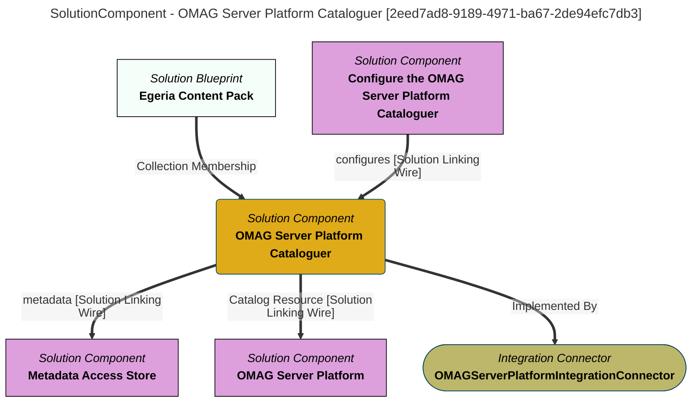

> OMAG Server Platform Cataloguer: Monitors the running OMAG Server Platform instances that are catalogued in the open metadata ecosystem and maintains the metadata that describes the servers and their configuration. (Extracted from 6.0-SNAPSHOT)
