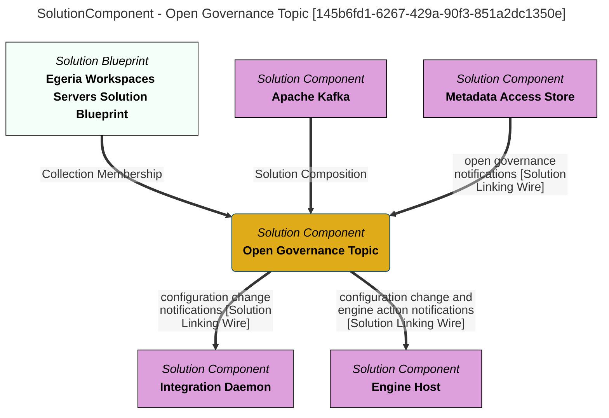

> Open Governance Topic: Provides notifications when governance server configuration (Governance engines, governance services, integration groups, and integration connectors) changes.  It also transmits changes to engine actions to allow the engine host to initiate the actions. (Extracted from 6.0-SNAPSHOT)
