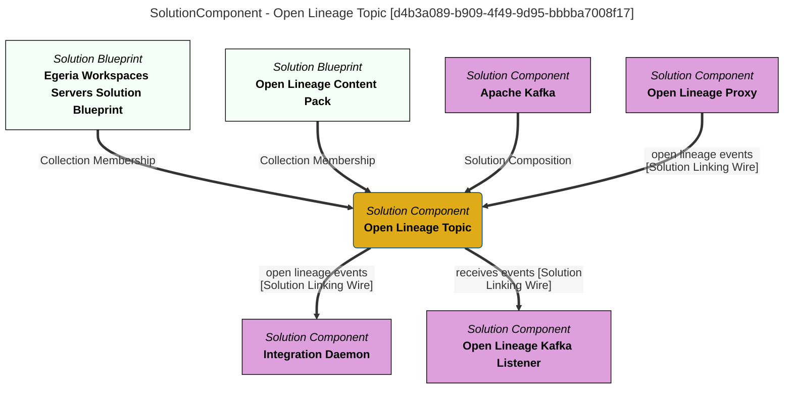

```mermaid
---
title: SolutionComponent - Open Lineage Topic [d4b3a089-b909-4f49-9d95-bbbba7008f17]
---
flowchart TD
%%{init: {"flowchart": {"htmlLabels": false}} }%%

1@{ shape: rounded, label: "*Solution Component*
**Open Lineage Topic**"}
2@{ shape: rect, label: "*Solution Blueprint*
**Egeria Workspaces Servers Solution Blueprint**"}
2==>|"Collection Membership"|1
3@{ shape: rect, label: "*Solution Blueprint*
**Open Lineage Content Pack**"}
3==>|"Collection Membership"|1
4@{ shape: rect, label: "*Solution Component*
**Apache Kafka**"}
4==>|"Solution Composition"|1
5@{ shape: rect, label: "*Solution Component*
**Open Lineage Proxy**"}
5==>|"open lineage events [Solution Linking Wire]"|1
6@{ shape: rect, label: "*Solution Component*
**Integration Daemon**"}
1==>|"open lineage events [Solution Linking Wire]"|6
7@{ shape: rect, label: "*Solution Component*
**Open Lineage Kafka Listener**"}
1==>|"receives events [Solution Linking Wire]"|7
style 1 color:#000000, fill:#e0ab18, stroke:#004563
style 2 color:#000000, fill:#f5fffa, stroke:#000000
style 3 color:#000000, fill:#f5fffa, stroke:#000000
style 4 color:#000000, fill:#dda0dd, stroke:#000000
style 5 color:#000000, fill:#dda0dd, stroke:#000000
style 6 color:#000000, fill:#dda0dd, stroke:#000000
style 7 color:#000000, fill:#dda0dd, stroke:#000000
click 1 "https://egeria-project.org/features/lineage-management/overview/#egerias-open-lineage-support" "Click for more documentation" _blank
click 4 "https://kafka.apache.org/" "Click for more documentation" _blank
click 5 "https://egeria-project.org/features/lineage-management/overview/#egerias-open-lineage-support" "Click for more documentation" _blank
click 6 "https://egeria-project.org/concepts/integration-daemon/" "Click for more documentation" _blank
click 7 "https://egeria-project.org/concepts/integration-connector/" "Click for more documentation" _blank
```
> Open Lineage Topic: Stores and distributes Open Lineage Events. (Extracted from 6.0-SNAPSHOT)
