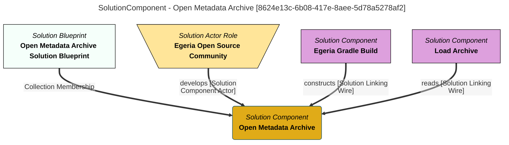

```mermaid
---
title: SolutionComponent - Open Metadata Archive [8624e13c-6b08-417e-8aee-5d78a5278af2]
---
flowchart TD
%%{init: {"flowchart": {"htmlLabels": false}} }%%

1@{ shape: rounded, label: "*Solution Component*
**Open Metadata Archive**"}
2@{ shape: rect, label: "*Solution Blueprint*
**Open Metadata Archive Solution Blueprint**"}
2==>|"Collection Membership"|1
3@{ shape: trap-t, label: "*Solution Actor Role*
**Egeria Open Source Community**"}
3==>|"develops [Solution Component Actor]"|1
4@{ shape: rect, label: "*Solution Component*
**Egeria Gradle Build**"}
4==>|"constructs [Solution Linking Wire]"|1
5@{ shape: rect, label: "*Solution Component*
**Load Archive**"}
5==>|"reads [Solution Linking Wire]"|1
style 1 color:#000000, fill:#e0ab18, stroke:#004563
style 2 color:#000000, fill:#f5fffa, stroke:#000000
style 3 color:#000000, fill:#FFE599, stroke:#000000
style 4 color:#000000, fill:#dda0dd, stroke:#000000
style 5 color:#000000, fill:#dda0dd, stroke:#000000
click 1 "https://egeria-project.org/concepts/open-metadata-archive/" "Click for more documentation" _blank
click 5 "https://egeria-project.org/concepts/open-metadata-archive/" "Click for more documentation" _blank
```
> Open Metadata Archive: An archive file containing pre-defined metadata types and instances. (Extracted from 6.0-SNAPSHOT)
