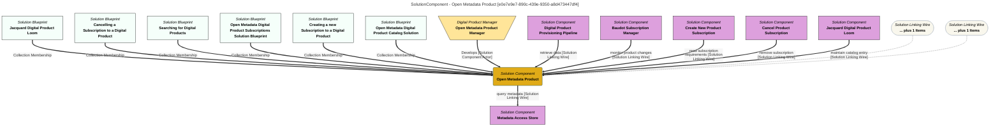

```mermaid
---
title: SolutionComponent - Open Metadata Product [e0e7e9e7-890c-439e-9350-a8d473447df4]
---
flowchart TD
%%{init: {"flowchart": {"htmlLabels": false}} }%%

1@{ shape: rounded, label: "*Solution Component*
**Open Metadata Product**"}
2@{ shape: rect, label: "*Solution Blueprint*
**Jacquard Digital Product Loom**"}
2==>|"Collection Membership"|1
3@{ shape: rect, label: "*Solution Blueprint*
**Cancelling a Subscription to a Digital Product**"}
3==>|"Collection Membership"|1
4@{ shape: rect, label: "*Solution Blueprint*
**Searching for Digital Products**"}
4==>|"Collection Membership"|1
5@{ shape: rect, label: "*Solution Blueprint*
**Open Metadata Digital Product Subscriptions Solution Blueprint**"}
5==>|"Collection Membership"|1
6@{ shape: rect, label: "*Solution Blueprint*
**Creating a new Subscription to a Digital Product**"}
6==>|"Collection Membership"|1
7@{ shape: rect, label: "*Solution Blueprint*
**Open Metadata Digital Product Catalog Solution**"}
7==>|"Collection Membership"|1
8@{ shape: trap-t, label: "*Digital Product Manager*
**Open Metadata Product Manager**"}
8==>|"Develops [Solution Component Actor]"|1
9@{ shape: rect, label: "*Solution Component*
**Metadata Access Store**"}
1==>|"query metadata [Solution Linking Wire]"|9
10@{ shape: rect, label: "*Solution Component*
**Digital Product Provisioning Pipeline**"}
10==>|"retrieve data [Solution Linking Wire]"|1
11@{ shape: rect, label: "*Solution Component*
**Baudot Subscription Manager**"}
11==>|"monitor product changes [Solution Linking Wire]"|1
12@{ shape: rect, label: "*Solution Component*
**Create New Product Subscription**"}
12==>|"read subscription requirements [Solution Linking Wire]"|1
13@{ shape: rect, label: "*Solution Component*
**Cancel Product Subscription**"}
13==>|"remove subscription [Solution Linking Wire]"|1
14@{ shape: rect, label: "*Solution Component*
**Jacquard Digital Product Loom**"}
14==>|"maintain catalog entry [Solution Linking Wire]"|1
15@{ shape: stadium, label: "*Solution Linking Wire*
**... plus 1 Items**"}
15-.->1
16@{ shape: stadium, label: "*Solution Linking Wire*
**... plus 1 Items**"}
16-.->1
style 11 color:#000000, fill:#dda0dd, stroke:#000000
style 12 color:#000000, fill:#dda0dd, stroke:#000000
style 13 color:#000000, fill:#dda0dd, stroke:#000000
style 14 color:#000000, fill:#dda0dd, stroke:#000000
style 15 color:#000000, fill:#F9F7ED, stroke:#b7c0c7
style 16 color:#000000, fill:#F9F7ED, stroke:#b7c0c7
style 1 color:#000000, fill:#e0ab18, stroke:#004563
style 2 color:#000000, fill:#f5fffa, stroke:#000000
style 3 color:#000000, fill:#f5fffa, stroke:#000000
style 4 color:#000000, fill:#f5fffa, stroke:#000000
style 5 color:#000000, fill:#f5fffa, stroke:#000000
style 6 color:#000000, fill:#f5fffa, stroke:#000000
style 7 color:#000000, fill:#f5fffa, stroke:#000000
style 8 color:#000000, fill:#FFE599, stroke:#000000
style 9 color:#000000, fill:#dda0dd, stroke:#000000
style 10 color:#000000, fill:#dda0dd, stroke:#000000
```
> Open Metadata Product: This is the component that represents the data for an open metadata digital products. (Extracted from 6.0-SNAPSHOT)
