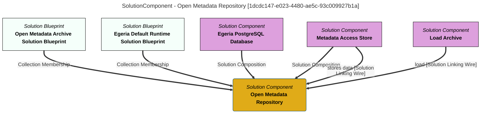

```mermaid
---
title: SolutionComponent - Open Metadata Repository [1dcdc147-e023-4480-ae5c-93c009927b1a]
---
flowchart TD
%%{init: {"flowchart": {"htmlLabels": false}} }%%

1@{ shape: rounded, label: "*Solution Component*
**Open Metadata Repository**"}
2@{ shape: rect, label: "*Solution Blueprint*
**Open Metadata Archive Solution Blueprint**"}
2==>|"Collection Membership"|1
3@{ shape: rect, label: "*Solution Blueprint*
**Egeria Default Runtime Solution Blueprint**"}
3==>|"Collection Membership"|1
4@{ shape: rect, label: "*Solution Component*
**Egeria PostgreSQL Database**"}
4==>|"Solution Composition"|1
5@{ shape: rect, label: "*Solution Component*
**Metadata Access Store**"}
5==>|"Solution Composition"|1
6@{ shape: rect, label: "*Solution Component*
**Load Archive**"}
6==>|"load [Solution Linking Wire]"|1
5==>|"stores data [Solution Linking Wire]"|1
style 1 color:#000000, fill:#e0ab18, stroke:#004563
style 2 color:#000000, fill:#f5fffa, stroke:#000000
style 3 color:#000000, fill:#f5fffa, stroke:#000000
style 4 color:#000000, fill:#dda0dd, stroke:#000000
style 5 color:#000000, fill:#dda0dd, stroke:#000000
style 6 color:#000000, fill:#dda0dd, stroke:#000000
click 1 "https://egeria-project.org/concepts/open-metadata-repository/" "Click for more documentation" _blank
click 5 "https://egeria-project.org/concepts/metadata-access-store/" "Click for more documentation" _blank
click 6 "https://egeria-project.org/concepts/open-metadata-archive/" "Click for more documentation" _blank
```
> Open Metadata Repository: A metadata repository supporting open metadata types and interfaces. (Extracted from 6.0-SNAPSHOT)
