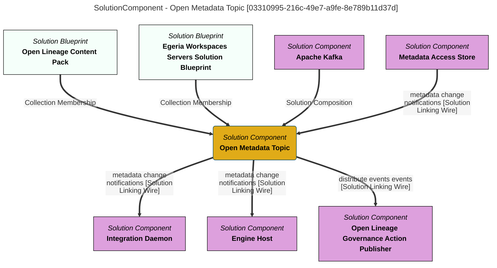

```mermaid
---
title: SolutionComponent - Open Metadata Topic [03310995-216c-49e7-a9fe-8e789b11d37d]
---
flowchart TD
%%{init: {"flowchart": {"htmlLabels": false}} }%%

1@{ shape: rounded, label: "*Solution Component*
**Open Metadata Topic**"}
2@{ shape: rect, label: "*Solution Blueprint*
**Open Lineage Content Pack**"}
2==>|"Collection Membership"|1
3@{ shape: rect, label: "*Solution Blueprint*
**Egeria Workspaces Servers Solution Blueprint**"}
3==>|"Collection Membership"|1
4@{ shape: rect, label: "*Solution Component*
**Apache Kafka**"}
4==>|"Solution Composition"|1
5@{ shape: rect, label: "*Solution Component*
**Metadata Access Store**"}
5==>|"metadata change notifications [Solution Linking Wire]"|1
6@{ shape: rect, label: "*Solution Component*
**Integration Daemon**"}
1==>|"metadata change notifications [Solution Linking Wire]"|6
7@{ shape: rect, label: "*Solution Component*
**Engine Host**"}
1==>|"metadata change notifications [Solution Linking Wire]"|7
8@{ shape: rect, label: "*Solution Component*
**Open Lineage Governance Action Publisher**"}
1==>|"distribute events events [Solution Linking Wire]"|8
style 1 color:#000000, fill:#e0ab18, stroke:#004563
style 2 color:#000000, fill:#f5fffa, stroke:#000000
style 3 color:#000000, fill:#f5fffa, stroke:#000000
style 4 color:#000000, fill:#dda0dd, stroke:#000000
style 5 color:#000000, fill:#dda0dd, stroke:#000000
style 6 color:#000000, fill:#dda0dd, stroke:#000000
style 7 color:#000000, fill:#dda0dd, stroke:#000000
style 8 color:#000000, fill:#dda0dd, stroke:#000000
click 1 "https://egeria-project.org/concepts/open-metadata-topic-connector/" "Click for more documentation" _blank
click 4 "https://kafka.apache.org/" "Click for more documentation" _blank
click 5 "https://egeria-project.org/concepts/metadata-access-store/" "Click for more documentation" _blank
click 6 "https://egeria-project.org/concepts/integration-daemon/" "Click for more documentation" _blank
click 7 "https://egeria-project.org/concepts/engine-host/" "Click for more documentation" _blank
click 8 "https://egeria-project.org/concepts/integration-connector/" "Click for more documentation" _blank
```
> Open Metadata Topic: Provides notifications when open metadata changes in any of the connected repositories. (Extracted from 6.0-SNAPSHOT)
