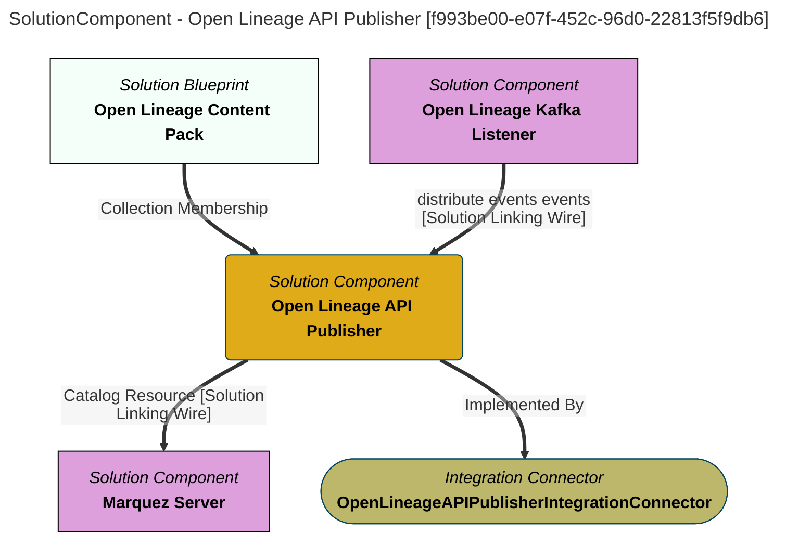

> Open Lineage API Publisher: Publishes open lineage events to APIs linked through CatalogTarget relationships.  These open lineage events may have been received from third party processes or were generated from running Governance Action Processes in the open metadata ecosystem. (Extracted from 6.0-SNAPSHOT)
