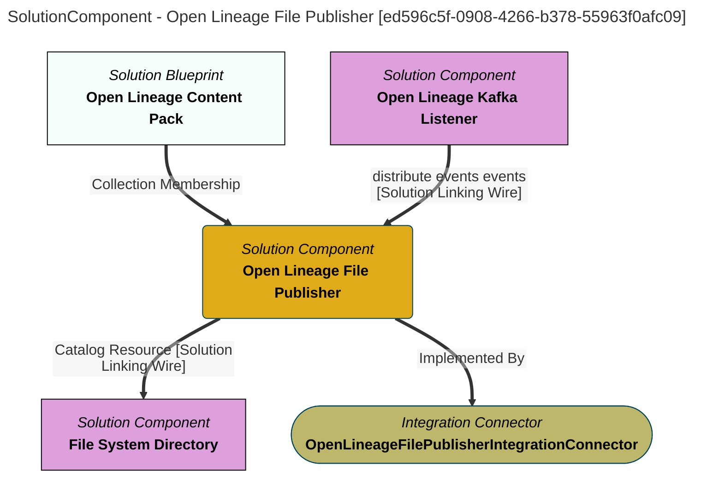

```mermaid
---
title: SolutionComponent - Open Lineage File Publisher [ed596c5f-0908-4266-b378-55963f0afc09]
---
flowchart TD
%%{init: {"flowchart": {"htmlLabels": false}} }%%

1@{ shape: rounded, label: "*Solution Component*
**Open Lineage File Publisher**"}
2@{ shape: rect, label: "*Solution Blueprint*
**Open Lineage Content Pack**"}
2==>|"Collection Membership"|1
3@{ shape: rect, label: "*Solution Component*
**File System Directory**"}
1==>|"Catalog Resource [Solution Linking Wire]"|3
4@{ shape: rect, label: "*Solution Component*
**Open Lineage Kafka Listener**"}
4==>|"distribute events events [Solution Linking Wire]"|1
5@{ shape: stadium, label: "*Integration Connector*
**OpenLineageFilePublisherIntegrationConnector**"}
1==>|"Implemented By"|5
style 1 color:#000000, fill:#e0ab18, stroke:#004563
style 2 color:#000000, fill:#f5fffa, stroke:#000000
style 3 color:#000000, fill:#dda0dd, stroke:#000000
style 4 color:#000000, fill:#dda0dd, stroke:#000000
style 5 color:#000000, fill:#bdb76b, stroke:#004563
click 1 "https://egeria-project.org/concepts/integration-connector/" "Click for more documentation" _blank
click 3 "https://egeria-project.org/types/2/0220-Files-and-Folders/" "Click for more documentation" _blank
click 4 "https://egeria-project.org/concepts/integration-connector/" "Click for more documentation" _blank
```
> Open Lineage File Publisher: Publishes open lineage events as JSON files to each of the file directories attached as catalog targets. (Extracted from 6.0-SNAPSHOT)
