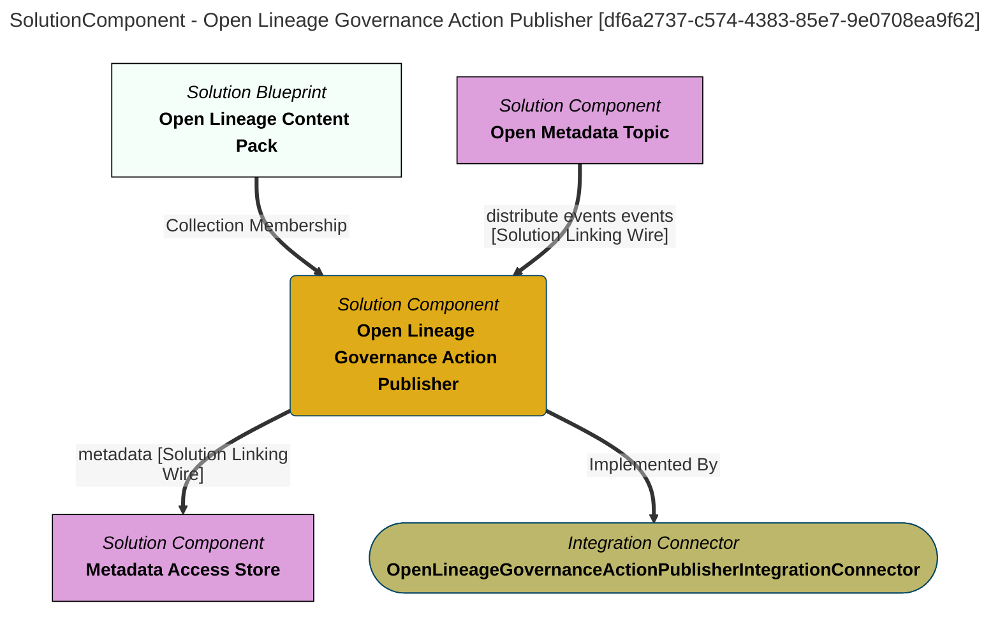

```mermaid
---
title: SolutionComponent - Open Lineage Governance Action Publisher [df6a2737-c574-4383-85e7-9e0708ea9f62]
---
flowchart TD
%%{init: {"flowchart": {"htmlLabels": false}} }%%

1@{ shape: rounded, label: "*Solution Component*
**Open Lineage Governance Action Publisher**"}
2@{ shape: rect, label: "*Solution Blueprint*
**Open Lineage Content Pack**"}
2==>|"Collection Membership"|1
3@{ shape: rect, label: "*Solution Component*
**Metadata Access Store**"}
1==>|"metadata [Solution Linking Wire]"|3
4@{ shape: rect, label: "*Solution Component*
**Open Metadata Topic**"}
4==>|"distribute events events [Solution Linking Wire]"|1
5@{ shape: stadium, label: "*Integration Connector*
**OpenLineageGovernanceActionPublisherIntegrationConnector**"}
1==>|"Implemented By"|5
style 1 color:#000000, fill:#e0ab18, stroke:#004563
style 2 color:#000000, fill:#f5fffa, stroke:#000000
style 3 color:#000000, fill:#dda0dd, stroke:#000000
style 4 color:#000000, fill:#dda0dd, stroke:#000000
style 5 color:#000000, fill:#bdb76b, stroke:#004563
click 1 "https://egeria-project.org/concepts/integration-connector/" "Click for more documentation" _blank
click 3 "https://egeria-project.org/concepts/metadata-access-store/" "Click for more documentation" _blank
click 4 "https://egeria-project.org/concepts/open-metadata-topic-connector/" "Click for more documentation" _blank
```
> Open Lineage Governance Action Publisher: Publishes open lineage events whenever governance actions run in the open metadata ecosystem. (Extracted from 6.0-SNAPSHOT)
