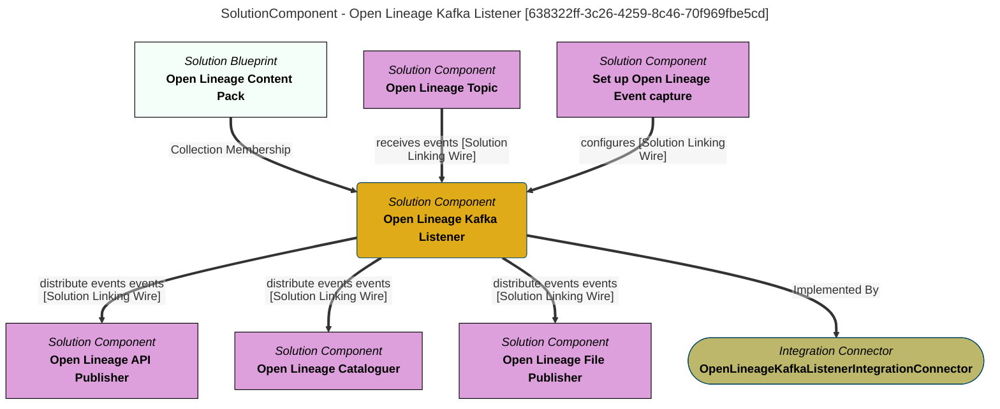

```mermaid
---
title: SolutionComponent - Open Lineage Kafka Listener [638322ff-3c26-4259-8c46-70f969fbe5cd]
---
flowchart TD
%%{init: {"flowchart": {"htmlLabels": false}} }%%

1@{ shape: rounded, label: "*Solution Component*
**Open Lineage Kafka Listener**"}
2@{ shape: rect, label: "*Solution Blueprint*
**Open Lineage Content Pack**"}
2==>|"Collection Membership"|1
3@{ shape: rect, label: "*Solution Component*
**Open Lineage API Publisher**"}
1==>|"distribute events events [Solution Linking Wire]"|3
4@{ shape: rect, label: "*Solution Component*
**Open Lineage Topic**"}
4==>|"receives events [Solution Linking Wire]"|1
5@{ shape: rect, label: "*Solution Component*
**Open Lineage Cataloguer**"}
1==>|"distribute events events [Solution Linking Wire]"|5
6@{ shape: rect, label: "*Solution Component*
**Set up Open Lineage Event capture**"}
6==>|"configures [Solution Linking Wire]"|1
7@{ shape: rect, label: "*Solution Component*
**Open Lineage File Publisher**"}
1==>|"distribute events events [Solution Linking Wire]"|7
8@{ shape: stadium, label: "*Integration Connector*
**OpenLineageKafkaListenerIntegrationConnector**"}
1==>|"Implemented By"|8
style 1 color:#000000, fill:#e0ab18, stroke:#004563
style 2 color:#000000, fill:#f5fffa, stroke:#000000
style 3 color:#000000, fill:#dda0dd, stroke:#000000
style 4 color:#000000, fill:#dda0dd, stroke:#000000
style 5 color:#000000, fill:#dda0dd, stroke:#000000
style 6 color:#000000, fill:#dda0dd, stroke:#000000
style 7 color:#000000, fill:#dda0dd, stroke:#000000
style 8 color:#000000, fill:#bdb76b, stroke:#004563
click 1 "https://egeria-project.org/concepts/integration-connector/" "Click for more documentation" _blank
click 3 "https://egeria-project.org/concepts/integration-connector/" "Click for more documentation" _blank
click 4 "https://egeria-project.org/features/lineage-management/overview/#egerias-open-lineage-support" "Click for more documentation" _blank
click 5 "https://egeria-project.org/concepts/integration-connector/" "Click for more documentation" _blank
click 6 "https://egeria-project.org/concepts/governance-action-type/" "Click for more documentation" _blank
click 7 "https://egeria-project.org/concepts/integration-connector/" "Click for more documentation" _blank
```
> Open Lineage Kafka Listener: Receives open lineage events from the open lineage proxy.  It listens for events from Apache Kafka topics attached as catalog targets. (Extracted from 6.0-SNAPSHOT)
